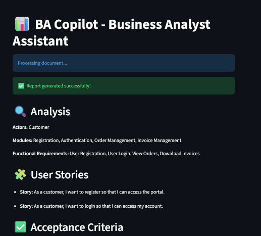

# BA Copilot - Agentic AI Business Analyst Assistant

## Overview

BA Copilot is a multi-agent AI system that automates Business Analyst activities from a requirement document.

The system converts business requirements into structured BA deliverables such as:

- Functional Requirements
- User Stories
- Acceptance Criteria
- Gap Analysis
- Effort Estimation
- Quality Review
- Refinement Recommendations

---

## Features

### Requirement Analyzer Agent
Extracts:

- Actors
- Modules
- Functional Requirements

### User Story Agent

Generates user stories in the format:

As a <user>,
I want <goal>,
So that <benefit>

### Acceptance Criteria Agent

Generates Given-When-Then style acceptance criteria.

### Gap Analysis Agent

Identifies:

- Missing Information
- Ambiguities
- Risks
- Clarification Questions

### Effort Estimation Agent

Provides:

- Complexity
- Story Points
- Estimated Effort
- Assumptions
- Risks

### Review Agent

Evaluates generated BA artifacts and identifies improvement opportunities.

### Refinement Agent

Uses review feedback to recommend report improvements.

### Streamlit UI

A simple Streamlit frontend is available in `app.py`.



---

## Architecture

Workflow:

Requirement
→ Analyzer Agent
→ User Story Agent
→ Acceptance Criteria Agent
→ Gap Analysis Agent
→ Effort Estimation Agent
→ Review Agent
→ Refinement Agent
→ BA Report

---

## Project Structure

```text
BA_Copilot/
│
├── agents/
├── core/
├── document/
├── prompts/
├── workflow/
├── outputs/
├── app.py
├── main.py
└── README.md
```

---

## Setup

Recommended: Python 3.11+.

### Environment Policy

This folder is the stable `V1` path using a custom orchestration framework.

- Use the virtual environment inside this folder only for `V1`.
- Do not install `V2` / LangGraph packages into this environment.
- Keep `V2` isolated in its own folder and own `.venv`.

1. Create and activate a virtual environment:

```powershell
python -m venv venv
venv\Scripts\Activate.ps1
```

2. Install the V1-only dependencies inside the active virtual environment:

```powershell
python -m pip install -r requirements.txt
```

---

## Run

### Backend only

```powershell
python main.py
```

This generates `outputs/ba_report.json` from `samples/requirement.txt`.

### Streamlit UI

```powershell
streamlit run app.py
```

The UI loads the same workflow state and displays the generated BA report.

---

## Notes

- The default input file is `samples/requirement.txt`.
- Update `main.py` or `build_state()` if you want to use a different source file.
- `app.py` imports `build_state()` from `main.py` so the UI and backend share the same workflow logic.

---

## Author

Suhail Riyaz
Agentic AI Enthusiast