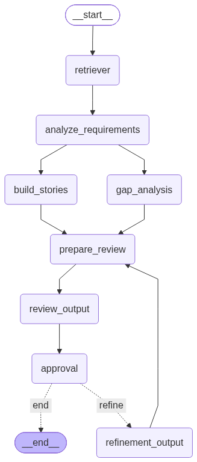

# BA Copilot V2 – Agentic Business Analyst Workflow

An agentic BA assistant built with LangGraph that automates the analysis of requirements, generates user stories, identifies gaps, reviews artefacts, and refines them via human-in-the-loop approval.

---

## 🚀 Features

- **Multi‑step BA workflow** – retriever → analysis → stories → gap analysis → review → approval → refinement
- **Fan‑out / fan‑in parallelism** – stories and gap analysis run in parallel after the initial analysis
- **Human‑in‑the‑loop approval** – pauses for user feedback before finalising
- **Refinement loop** – automatically re‑enters the review pipeline if the user rejects the current output
- **SQLite checkpointing** – persists workflow state across runs (using LangGraph's `SqliteSaver`)
- **Provider‑agnostic LLM integration** – works with DeepSeek API (easily extendable to other providers)

---

## 🧱 Architecture (Graph)



```
START
  │
  ▼
retriever                ← loads requirement document
  │
  ▼
analyze_requirements     ← extracts actors, modules, needs
  ╱              ╲
 ╱                ╲
▼                   ▼
build_stories          gap_analysis       ← (parallel)
 ╲                ╱
  ╲              ╱
   ▼            ▼
 prepare_review         ← builds review context
      │
      ▼
 review_output          ← LLM scores & provides feedback
      │
      ▼
 approval               ← interrupt() for user decision
    ╱    ╲
   ╱      ╲
  ▼        ▼
 END     refinement_output  ← rewrites stories based on feedback
          │
          └──→ prepare_review (loop)
```

### Router
- `routers/approval_router.py` – decides whether to finish or refine based on the `approved` state flag.

To regenerate the graph image, run the workflow or execute:
```python
python -c "from graph import graph; graph.get_graph().draw_mermaid_png(output_file_path='ba_copilot_graph.png')"
```

---

## 🛠️ Setup

### 1. Clone or navigate to the V2 directory
```bash
cd BA_Copilot_V2
```

### 2. Create a virtual environment & install dependencies
```bash
python -m venv .venv
.venv\Scripts\activate   # Windows
# or source .venv/bin/activate  # Linux/macOS
pip install -r requirements.txt
```

### 3. Configure environment variables
Copy the example and fill in your API key:
```bash
cp .env.example .env
```
Edit `.env`:
```env
DEEPSEEK_API_KEY=sk-xxxxxxxxxxxxxxxxxxxxxxxxx
DEEPSEEK_BASE_URL=https://api.deepseek.com   # optional
```
The `.env` file is ignored by git (see `.gitignore`).

### 4. Prepare input requirements
Place your requirement document (plain text) at `input/requirement.txt`.

---

## ▶️ Usage

Run the main script:
```bash
python main.py
```

The workflow will:
1. Load the requirement
2. Stream through the graph until the approval node
3. Pause and ask you: **"Approve BA Report? (yes/no)"**
4. If `no` → it refines the stories and loops back to review
5. If `yes` → the final state is printed and the workflow ends

### Visualise the graph
In `main.py`, a Mermaid PNG is drawn at the end. You can also export the Mermaid markup:
```python
mermaid_code = graph.get_graph().draw_mermaid()
```

---

## 📁 Project Structure

```
BA_Copilot_V2/
├── main.py                 # Entry point; handles streaming & interrupts
├── state.py                # BAState TypedDict definition
├── graph.py                # Graph construction with nodes, edges, routers
├── ba_copilot_graph.png    # Visual representation of the workflow
│
├── nodes/                  # Individual workflow steps
│   ├── retriever.py        # loads requirement file → state["requirement"]
│   ├── analyzer.py         # LLM analysis → state["analysis"]
│   ├── stories.py          # LLM user story generation → state["stories"]
│   ├── gap_analysis.py     # LLM gap detection → state["gaps"]
│   ├── prepare_review.py   # assembles review context → state["review_context"]
│   ├── review.py           # LLM review & scoring → state["review"]
│   ├── approval.py         # interrupt() for human approval → state["approved"]
│   └── refinement.py       # refines stories based on review → state["refinement"]
│
├── models/                 # Pydantic output models
│   ├── analysis.py
│   ├── stories.py
│   ├── gaps.py
│   ├── review.py
│   └── refinement.py
│
├── prompts/                # Prompt templates (with {placeholders})
│   ├── analysis.txt
│   ├── user_story.txt
│   ├── gap_analysis.txt
│   ├── review.txt
│   └── refinement.txt
│
├── routers/
│   └── approval_router.py  # Conditional edge logic
│
├── llm/
│   ├── provider_factory.py # Creates LLM instance based on settings
│   └── settings.py         # Reads environment variables
│
├── utils/
│   ├── prompt_loader.py    # Loads .txt prompt files
│   └── json_parser.py      # Parses LLM JSON responses safely
│
├── document/               # Document processing utilities (optional)
│   └── document_processor.py
│
├── input/
│   └── requirement.txt     # Your raw requirement document
│
├── .env.example            # Template for environment variables
├── .env                    # (ignored) Actual secrets
├── .gitignore
└── requirements.txt        # Python dependencies
```

---

## 🔐 Security

- **API keys** are stored in `.env` and **never committed**. See `.env.example`.
- Run `git grep -i "sk-"` to ensure no key leaks.
- If you ever accidentally commit a key, rotate it immediately on the DeepSeek dashboard.

---

## 🧪 Dependencies (key)

- `langgraph >= 0.2.60`
- `langgraph-checkpoint >= 2.0.10`
- `langgraph-checkpoint-sqlite >= 2.0.3`
- `python-dotenv`
- `langchain-openai` (for DeepSeek‑compatible API)
- `pydantic`

See `requirements.txt` for the exact list.

---

## 📝 License

MIT – feel free to use and modify.
```