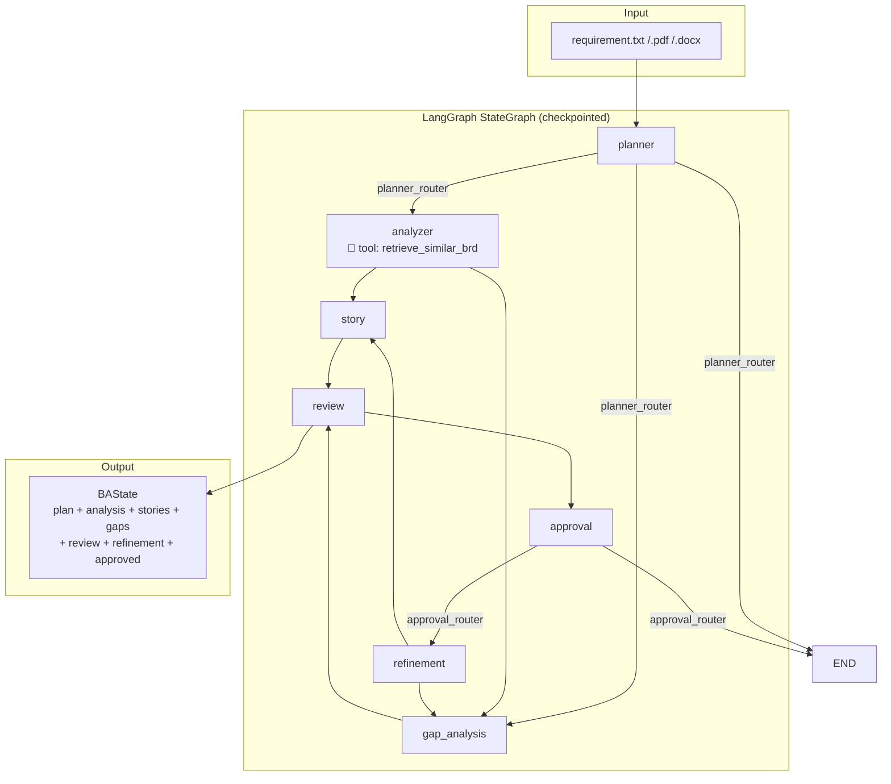
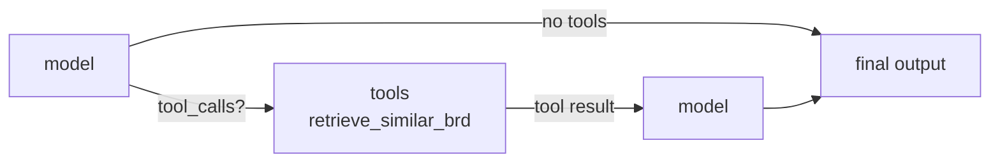

# BA Copilot V3 — Architecture Document

## Overview

V3 is a **LangGraph StateGraph** that orchestrates a multi-agent Business Analyst workflow. It uses a planner-router for dynamic branching, a ReAct tool-calling agent for analysis enrichment, parallel fan-out for stories + gap analysis, and an approval router for iterative refinement.

---

## 1. High-Level Architecture



---

## 2. State Management: `BAState`

```python
class BAState(TypedDict):
    requirement: str
    plan: PlanOutput
    analysis: AnalysisOutput
    stories: StoryOutput
    gaps: GapOutput
    review: ReviewOutput
    refinement: RefinementOutput
    approved: bool | None
    iteration: int
```

- **TypedDict** — typed dictionary shared across all graph nodes.
- Each node returns a partial update (e.g., `{"analysis": result}`).
- State is persisted via **SQLite checkpointing** (`SqliteSaver`), enabling pause/resume with the same `thread_id`.

### Pydantic Output Models

| Model | Fields |
|-------|--------|
| `PlanOutput` | `next_step`, `reason` |
| `AnalysisOutput` | `actors`, `modules`, `requirements` |
| `GapOutput` | `gaps_found`, `gaps` |
| `StoryOutput` | `user_stories` |
| `ReviewOutput` | `quality_score`, `strengths`, `weaknesses`, `recommendations` |
| `RefinementOutput` | `improvements`, `final_summary` |

---

## 3. Agent Pattern

Every agent follows the same pattern via `invoke_with_validation()`:

```python
def invoke_with_validation(invokable, payload, model_class, max_attempts=2):
    for attempt in range(max_attempts):
        response = invokable.invoke(payload)
        text = _extract_text(response)         # AIMessage → string or dict["messages"] → string
        json_dict = parse_llm_json(text)        # strip markdown fences, parse JSON
        try:
            return model_class.model_validate(json_dict)
        except (ValidationError, ValueError) as e:
            payload = append_validation_feedback(payload, e)  # retry with error context
    raise last_error
```

### Two invokable types

| Agent | Invokable | Tools |
|-------|-----------|-------|
| planner, gap, story, review, refinement | `ChatOpenAI` instance | — |
| **analyzer** | `create_agent(model=llm, tools=[retrieve_similar_brd])` | ✅ ReAct agent |

### Why two types?

- **Stateless agents** (planner, gap, story, review, refinement): one-shot `llm.invoke(prompt)` — cheaper, faster. No tools needed.
- **Stateful agent** (analyzer): `create_agent` wraps the LLM in a ReAct loop (`model → tools → model`). The agent can call `retrieve_similar_brd` to fetch BRD knowledge, then incorporate results into its final output.

---

## 4. Router Pattern

### Planner Router

```python
def planner_router(state) -> str:
    return state["plan"].next_step   # "analyze_requirements" | "gap_analysis" | "done"
```

The planner LLM decides the first step. The router maps strings to nodes:
- `"analyze_requirements"` → `analyzer` node
- `"gap_analysis"` → `gap_analysis` node
- `"done"` → `END`

### Approval Router

```python
def approval_router(state) -> str:
    if state.get("approved"):
        return "end"
    if state.get("iteration", 0) >= 3:
        return "end"     # cap reached
    return "refinement"
```

Enables automatic iterative refinement. If the review flags issues (`approved=False`), the workflow loops through refinement → story/gap → review until approved or the iteration cap is hit.

---

## 5. Tool-Calling Agent (Analyzer)

The analyzer is the only ReAct agent:

```
create_agent(model=llm, tools=[retrieve_similar_brd])
```

Internal graph:



The `retrieve_similar_brd` tool returns BRD knowledge (password policy, MFA, session timeout, etc.). This enriches the analysis with domain-specific requirements not explicitly stated in the input.

---

## 6. Prompt Management

Prompts are plain `.txt` files loaded by `prompt_loader.py`. Each node formats its prompt with state data:

| Prompt | Format Keys | Loaded By |
|--------|------------|-----------|
| `planner.txt` | `{requirement}` | `planner_node` |
| `analyzer.txt` | `{requirement}` | `analyzer_node` |
| `gap.txt` | `{requirement}`, `{analysis}` | `gap_node` |
| `story.txt` | `{analysis}` | `story_node` |
| `review.txt` | `{analysis}`, `{stories}`, `{gaps}` | `review_node` |
| `refinement.txt` | `{analysis}`, `{stories}`, `{gaps}`, `{review}` | `refinement_node` |

---

## 7. Checkpointing

```python
conn = sqlite3.connect('ba_copilot_v3.db', check_same_thread=False)
checkpointer = SqliteSaver(conn)
graph = builder.compile(checkpointer=checkpointer)
```

- **SQLite-backed** — survives restarts.
- **Thread-ID scoped** — `config={"configurable": {"thread_id": "portal_project_v3"}}` isolates runs.
- **Monkey-patched `JsonPlusSerializer`** — adds missing `dumps`/`loads` methods for metadata serialization.

---

## 8. LLM Provider

```python
# deepseek_provider.py
class DeepSeekProvider:
    @staticmethod
    def get_llm():
        return ChatOpenAI(
            model="deepseek-chat",
            api_key=os.getenv("DEEPSEEK_API_KEY"),
            base_url="https://api.deepseek.com",
            temperature=0,
        )
```

- Uses `langchain-openai` `ChatOpenAI` pointed at DeepSeek's API (OpenAI-compatible).
- `temperature=0` for deterministic, reproducible output.
- All agents share the same LLM instance pattern via `ProviderFactory.get_llm()`.

---

## 9. Key Design Decisions

| Decision | Rationale |
|----------|-----------|
| **Planner router** vs fixed flow | Different requirements need different analysis paths |
| **`create_agent` for analyzer only** | Only the analyzer needs tool calling; other agents are cheaper as direct LLM calls |
| **Shared `invoke_with_validation`** | DRY retry logic with error feedback across all agents |
| **Parallel story + gap** | Independent tasks; fan-out reduces latency |
| **Approval router with iteration cap** | Prevents infinite loops while allowing automated refinement |
| **SQLite checkpointing** | Lightweight persistence without external dependencies |
| **Prompt templates as `.txt` files** | Easy to edit, version-control, and iterate on prompts |
| **`parse_llm_json` with markdown stripping** | LLMs often wrap JSON in ``` fences; robust parsing handles this |

---

## 10. Data Flow (End-to-End)

```
input/requirement.txt
       │
       ▼
DocumentProcessor.extract_text()
       │
       ▼
graph.stream({requirement, iteration, max_iterations})
       │
       ▼
┌──────────────────────────────────────────────────┐
│ planner_node                                     │
│   load_prompt("planner.txt").format(requirement)  │
│   planner_agent(prompt) → PlanOutput             │
└──────────────────────────────────────────────────┘
       │
       ▼ (planner_router: "analyze_requirements")
┌──────────────────────────────────────────────────┐
│ analyzer_node                                    │
│   load_prompt("analyzer.txt").format(requirement) │
│   analyzer_agent(prompt) → AnalysisOutput         │
│   (internally: create_agent + retrieve_similar_brd)│
└──────────────────────────────────────────────────┘
       │
       ├──→ story_node → StoryOutput
       │         │
       │         ▼
       │    ┌──────────────────────┐
       │    │ review_node          │
       ├──→ │ ← story + gaps       │ → ReviewOutput
       │    └──────────────────────┘
       │              │
       └──→ gap_node → GapOutput
                      │
                      ▼
              ┌──────────────────────┐
              │ approval_node        │
              │   approved?          │
              │   ├── yes → END      │
              │   └── no  → refinement│
              └──────────────────────┘
                      │
                      ▼
              ┌──────────────────────┐
              │ refinement_node      │ → RefinementOutput
              │ (loops to story/gap) │
              └──────────────────────┘
```
