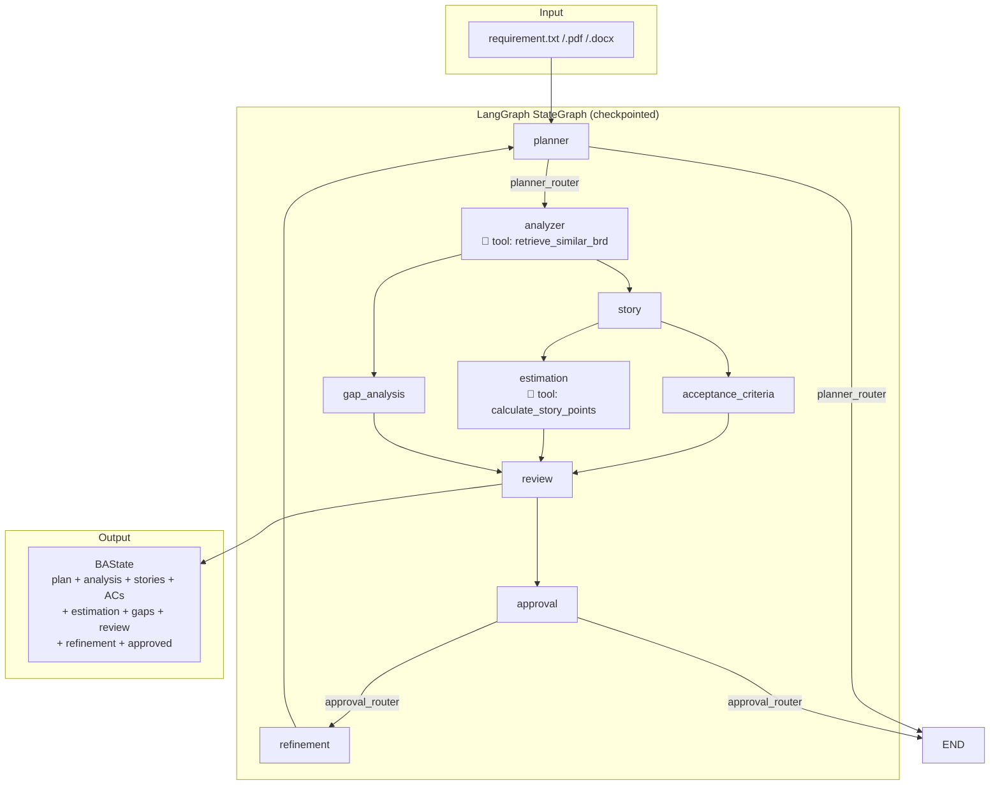
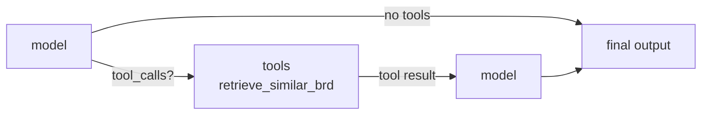

# BA Copilot V3 — Architecture Document

## Overview

V3 is a **LangGraph StateGraph** that orchestrates a multi-agent Business Analyst workflow. It uses a planner-router for dynamic branching, a ReAct tool-calling agent for analysis enrichment, parallel fan-out for stories → acceptance criteria + estimation, and an approval router for iterative refinement with human-in-the-loop.

---

## 1. High-Level Architecture



---

## 2. State Management: `BAState`

```python
class BAState(TypedDict):
    requirement: str
    plan: PlanOutput
    analysis: AnalysisOutput
    stories: StoryOutput
    acceptance_criteria: AcceptanceOutput
    estimation: EstimationOutput
    gaps: GapOutput
    review: ReviewOutput
    refinement: RefinementOutput
    approved: bool | None
    iteration: int
    max_iterations: int
```

- **TypedDict** — typed dictionary shared across all graph nodes.
- Each node returns a partial update (e.g., `{"analysis": result}`).
- State is persisted via **SQLite checkpointing** (`SqliteSaver`), enabling pause/resume with the same `thread_id`.

### Pydantic Output Models

| Model | Fields |
|-------|--------|
| `PlanOutput` | `next_step: Literal["analyze_requirements", "done"]`, `reason` |
| `AnalysisOutput` | `actors`, `modules`, `requirements` |
| `GapOutput` | `gaps_found`, `gaps` |
| `StoryOutput` | `user_stories: list[str]` |
| `AcceptanceOutput` | `criteria: list[StoryCriteria]` |
| `EstimationOutput` | `estimates: list[StoryEstimate]` |
| `ReviewOutput` | `quality_score`, `strengths`, `weaknesses`, `recommendations` |
| `RefinementOutput` | `improvements`, `final_summary` |

---

## 3. Agent Pattern

Every agent follows the same pattern via `invoke_with_validation()`:

```python
def invoke_with_validation(invokable, payload, model_class, max_attempts=2):
    for attempt in range(max_attempts):
        response = invokable.invoke(payload)
        text = _extract_text(response)         # AIMessage → string or dict["messages"] → string
        json_dict = parse_llm_json(text)        # strip markdown fences, parse JSON
        try:
            return model_class.model_validate(json_dict)
        except (ValidationError, ValueError) as e:
            payload = append_validation_feedback(payload, e)  # retry with error context
    raise last_error
```

### Two invokable types

| Agent | Invokable | Tools |
|-------|-----------|-------|
| planner, gap, story, acceptance, review, refinement | `ChatOpenAI` instance | — |
| **analyzer** | `create_agent(model=llm, tools=[retrieve_similar_brd])` | ✅ ReAct agent |
| **estimation** | `create_agent(model=llm, tools=[calculate_story_points])` | ✅ ReAct agent |

### Why two types?

- **Stateless agents** (planner, gap, story, acceptance, review, refinement): one-shot `llm.invoke(prompt)` — cheaper, faster. No tools needed.
- **Stateful agents** (analyzer, estimation): `create_agent` wraps the LLM in a ReAct loop (`model → tools → model`).

---

## 4. Router Pattern

### Planner Router

```python
_VALID_STEPS = {"analyze_requirements", "done"}

def planner_router(state) -> str:
    step = state["plan"].next_step   # Literal-validated by Pydantic
    if step not in _VALID_STEPS:
        return "done"                # defense-in-depth fallback
    return step
```

The planner LLM decides the first step. The `PlanOutput` model uses `Literal["analyze_requirements", "done"]` for validation. The router adds a defense-in-depth guard.

### Approval Router

```python
def approval_router(state) -> str:
    if state.get("approved") is True:          # explicit boolean check
        return "end"
    if state.get("iteration", 0) >= state.get("max_iterations", 3):
        return "end"
    return "refinement"
```

Enables iterative refinement with human-in-the-loop. If the user rejects (`approved=False` or `None`), the workflow loops: `refinement → planner → analyzer → ... → approval` until approved or the iteration cap is reached.

### Guardrail Fail-Open → Human Intervention (TODO)

When a guardrail (completeness or quality) fails after `max_attempts`, the agents
currently **fail-open silently** — they return the last output and only log a
warning, so the workflow never learns that a gate failed.

Planned design (not yet implemented):

1. Agents return the verdict alongside the artifact
   (e.g. `(StoryOutput, GuardrailResult)`), instead of swallowing it.
2. Nodes store the verdict in `BAState` as plain dicts
   (`story_verdict`, `ac_verdict`, `gap_verdict`) so it survives checkpointing.
3. `approval_node` includes any gate failures in its `interrupt` message.
4. `main.py` reads the pending `interrupt` payload and shows it to the user
   before resuming, instead of the hardcoded "Approve BA Report?" prompt.
5. `approval_router` already handles the decision: reject → `refinement`
   (regenerate), approve → `END`.

Alternative (more granular): call `interrupt` directly inside the failing node
so it pauses immediately on a per-artifact gate failure.

---

## 5. Tool-Calling Agent (Analyzer)

The analyzer is the only ReAct agent:

```
create_agent(model=llm, tools=[retrieve_similar_brd])
```

Internal graph:



The `retrieve_similar_brd` tool returns BRD knowledge (password policy, MFA, session timeout, etc.). This enriches the analysis with domain-specific requirements not explicitly stated in the input.

---

## 6. Prompt Management

Prompts are plain `.txt` files loaded by `prompt_loader.py`. Each node formats its prompt with state data:

| Prompt | Format Keys | Loaded By |
|--------|------------|-----------|
| `planner.txt` | `{requirement}`, `{iteration}`, `{max_iterations}`, `{review_context}`, `{refinement_context}` | `planner_node` |
| `analyzer.txt` | `{requirement}` | `analyzer_node` |
| `gap.txt` | `{requirement}`, `{analysis}` | `gap_node` |
| `story.txt` | `{analysis}`, `{story_standard}` | `story_node` |
| `acceptance_criteria.txt` | `{stories}`, `{acceptance_standard}` | `acceptance_node` |
| `estimate_stories.txt` | `{stories}` | `estimation_node` |
| `review.txt` | `{analysis}`, `{stories}`, `{acceptance_criteria}`, `{estimation}`, `{gaps}` | `review_node` |
| `refinement.txt` | `{analysis}`, `{stories}`, `{acceptance_criteria}`, `{estimation}`, `{gaps}`, `{review}` | `refinement_node` |

---

## 7. Checkpointing

```python
conn = sqlite3.connect('ba_copilot_v3.db', check_same_thread=False)
_serde = JsonPlusSerializer().with_msgpack_allowlist([
    ("models.plan", "PlanOutput"),
    ("models.analysis", "AnalysisOutput"),
    ("models.story", "StoryOutput"),
    ("models.acceptance", "AcceptanceOutput"),
    ("models.estimation", "EstimationOutput"),
    ("models.gaps", "GapOutput"),
    ("models.review", "ReviewOutput"),
    ("models.refinement", "RefinementOutput"),
])
checkpointer = SqliteSaver(conn, serde=_serde)
graph = builder.compile(checkpointer=checkpointer)
```

- **SQLite-backed** — survives restarts.
- **Thread-ID scoped** — `config={"configurable": {"thread_id": "portal_project_v3"}}` isolates runs.
- **Msgpack model registration** — all Pydantic models registered via `with_msgpack_allowlist()` for proper serialization.
- **Monkey-patched `JsonPlusSerializer`** — adds missing `dumps`/`loads` methods for metadata serialization.

---

## 8. LLM Provider

```python
# deepseek_provider.py
class DeepSeekProvider:
    @staticmethod
    def get_llm():
        return ChatOpenAI(
            model="deepseek-chat",
            api_key=os.getenv("DEEPSEEK_API_KEY"),
            base_url="https://api.deepseek.com",
            temperature=0,
        )
```

- Uses `langchain-openai` `ChatOpenAI` pointed at DeepSeek's API (OpenAI-compatible).
- `temperature=0` for deterministic, reproducible output.
- All agents share the same LLM instance pattern via `ProviderFactory.get_llm()`.

---

## 9. Key Design Decisions

| Decision | Rationale |
|----------|-----------|
| **Planner router** vs fixed flow | Different requirements need different analysis paths |
| **`create_agent` for analyzer only** | Only the analyzer needs tool calling; other agents are cheaper as direct LLM calls |
| **Shared `invoke_with_validation`** | DRY retry logic with error feedback across all agents |
| **Parallel story + gap** | Independent tasks; fan-out reduces latency |
| **Approval router with iteration cap** | Prevents infinite loops while allowing automated refinement |
| **SQLite checkpointing** | Lightweight persistence without external dependencies |
| **Prompt templates as `.txt` files** | Easy to edit, version-control, and iterate on prompts |
| **`parse_llm_json` with markdown stripping** | LLMs often wrap JSON in ``` fences; robust parsing handles this |

---

## 10. Data Flow (End-to-End)

```
input/requirement.txt
       │
       ▼
DocumentProcessor.extract_text()
       │
       ▼
graph.stream({requirement, iteration, max_iterations})
       │
       ▼
┌──────────────────────────────────────────────────┐
│ planner_node                                     │
│   load_prompt("planner.txt").format(requirement)  │
│   planner_agent(prompt) → PlanOutput             │
└──────────────────────────────────────────────────┘
       │
       ▼ (planner_router: "analyze_requirements")
┌──────────────────────────────────────────────────┐
│ analyzer_node                                    │
│   load_prompt("analyzer.txt").format(requirement) │
│   analyzer_agent(prompt) → AnalysisOutput         │
│   (internally: create_agent + retrieve_similar_brd)│
└──────────────────────────────────────────────────┘
       │
       ├──→ story_node → StoryOutput
       │         │
       │         ▼
       │    ┌──────────────────────┐
       │    │ review_node          │
       ├──→ │ ← story + gaps       │ → ReviewOutput
       │    └──────────────────────┘
       │              │
       └──→ gap_node → GapOutput
                      │
                      ▼
              ┌──────────────────────┐
              │ approval_node        │
              │   approved?          │
              │   ├── yes → END      │
              │   └── no  → refinement│
              └──────────────────────┘
                      │
                      ▼
              ┌──────────────────────┐
              │ refinement_node      │ → RefinementOutput
              │ (loops to story/gap) │
              └──────────────────────┘
```
