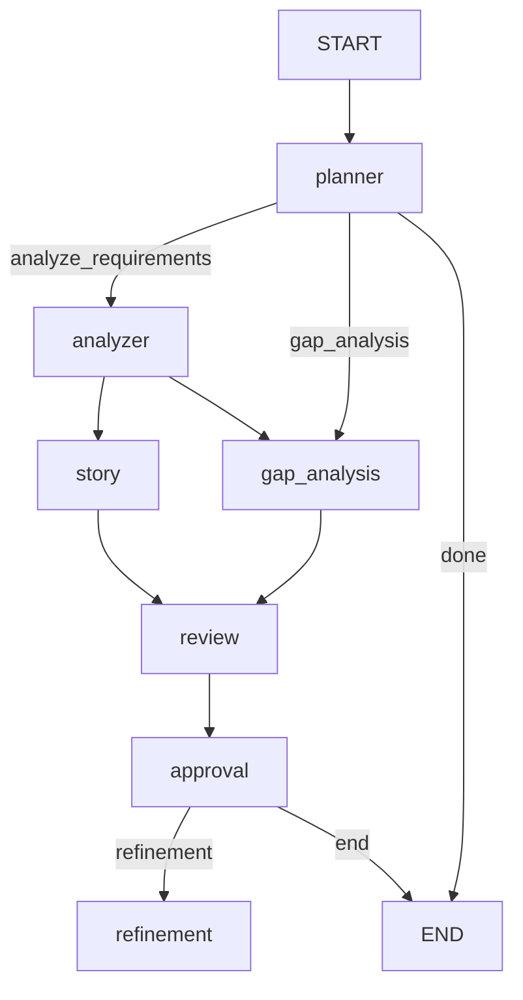

# BA Copilot V3 — LangGraph Agentic Workflow

**V3** is a production-ready, graph-based Business Analyst AI system built on **LangGraph** with checkpointing, conditional routing, tool-calling agents, and an iterative refinement loop.

---

## 🧠 Workflow



| # | Node | Agent | Tools | Output |
|---|------|-------|-------|--------|
| 1 | `planner` | `planner_agent` | — | `PlanOutput` (next_step, reason) |
| 2a | `analyzer` | `analyzer_agent` | `retrieve_similar_brd` | `AnalysisOutput` (actors, modules, requirements) |
| 2b | `gap_analysis` | `gap_agent` | — | `GapOutput` (gaps_found, gaps) |
| 3 | `story` | `story_agent` | — | `StoryOutput` (user_stories) |
| 4 | `review` | `review_agent` | — | `ReviewOutput` (quality_score, strengths, weaknesses, recommendations) |
| 5 | `approval` | — (router) | — | Routes to `refinement` or `END` based on `approved` flag + iteration cap |
| 6 | `refinement` | `refinement_agent` | — | `RefinementOutput` (improvements, final_summary) |

- **Planner router** decides the first branch: `analyze_requirements` → full pipeline, or `gap_analysis` → gap-only review.
- **Approval router** enables iterative refinement: if not approved and under iteration cap, loops to `refinement`.
- **Analyzer** is the only agent with a tool (`retrieve_similar_brd`) — a ReAct agent that can look up BRD knowledge.

---

## 🗂️ Project Structure

```
BA_Copilot_V3/
├── main.py                  # Entry point
├── state.py                 # BAState TypedDict (shared graph state)
├── graph/
│   └── graph.py             # LangGraph StateGraph definition + checkpointing
├── agents/                  # Agent functions (invoke + validate)
│   ├── planner_agent.py
│   ├── analyzer_agent.py    # ← has tool: retrieve_similar_brd
│   ├── gap_agent.py
│   ├── story_agent.py
│   ├── review_agent.py
│   └── refinement_agent.py
├── nodes/                   # Graph node functions (load prompt → call agent)
│   ├── planner_node.py
│   ├── analyzer_node.py
│   ├── gap_node.py
│   ├── story_node.py
│   ├── review_node.py
│   ├── approval_node.py
│   └── refinement_node.py
├── routers/                 # Conditional edge logic
│   ├── planner_router.py
│   └── approval_router.py
├── models/                  # Pydantic output schemas
│   ├── plan.py
│   ├── analysis.py
│   ├── gaps.py
│   ├── story.py
│   ├── review.py
│   └── refinement.py
├── prompts/                 # Prompt templates (loaded by nodes)
│   ├── planner.txt
│   ├── analyzer.txt
│   ├── gap.txt
│   ├── story.txt
│   ├── review.txt
│   └── refinement.txt
├── llm/                     # LLM provider (DeepSeek via OpenAI-compatible)
│   ├── deepseek_provider.py
│   ├── provider_factory.py
│   └── settings.py
├── tools/
│   └── retriever.py         # BRD knowledge retrieval tool
├── utils/
│   ├── invoke_with_validation.py   # Retry + structured validation
│   ├── append_validation_feedback.py
│   ├── json_parser.py
│   └── prompt_loader.py
├── document/
│   └── document_processor.py       # .txt / .pdf / .docx reader
├── input/
│   └── requirement.txt             # Sample input
├── requirements.txt
└── .env                    # DEEPSEEK_API_KEY, MODEL_NAME, etc.
```

---

## 🔧 Key Design Patterns

### Agent pattern (shared by all agents)

```
invoke_with_validation(invokable, payload, model_class)
  → invokable.invoke(payload)
  → parse_llm_json(response)
  → model_validate(json)
  → on failure: append error to payload, retry up to 2 times
```

- **Planner / Gap / Story / Review / Refinement**: stateless `llm.invoke(prompt)` — no tools needed.
- **Analyzer**: stateful `create_agent(model=llm, tools=[retriever])` — ReAct agent loop with tool calling.

### Router pattern

```python
def planner_router(state) -> str:
    return state["plan"].next_step    # "analyze_requirements" | "gap_analysis" | "done"
```

### Checkpointing

SQLite-backed via `SqliteSaver` — enables pause/resume, state inspection, and replay with the same `thread_id`.

---

## 🚀 Getting Started

### 1. Setup

```bash
cd BA_Copilot_V3
python -m venv .venv
.venv\Scripts\activate     # Windows
pip install -r requirements.txt
```

### 2. Configure

Create `.env` in `BA_Copilot_V3/`:

```env
MODEL_PROVIDER=deepseek
MODEL_NAME=deepseek-chat
DEEPSEEK_API_KEY=sk-...
DEEPSEEK_BASE_URL=https://api.deepseek.com
```

### 3. Add input

Edit `input/requirement.txt` with your requirement document. Supports `.txt`, `.pdf`, `.docx`.

### 4. Run

```bash
python main.py
```

---

## 📊 Sample Input → Output

### Input (`input/requirement.txt`)

```
Build a customer portal where users can:

- Register
- Login
- View Orders
- Download Invoices
```

### Output (console)

```
Event: {'planner': {'plan': PlanOutput(next_step='analyze_requirements')}}

Event: {'analyze_requirements': {'analysis': AnalysisOutput(
    actors=['Customer', 'System Administrator'],
    modules=['User Registration', 'Authentication', 'Order Management', 'Invoice Management'],
    requirements=[
        'The system shall allow new users to register for a customer portal account.',
        'The system shall allow registered users to log in to the customer portal.',
        'The system shall allow authenticated users to view their orders.',
        'The system shall allow authenticated users to download their invoices.',
    ]
)}}

...

RESULT
==================================================
{'requirement': 'Build a customer portal where users can: ...',
 'plan': PlanOutput(next_step='analyze_requirements'),
 'analysis': AnalysisOutput(actors=[...], modules=[...], requirements=[...]),
 'stories': StoryOutput(user_stories=[
     'As a customer, I want to register an account so that I can access the portal.',
     ...
 ]),
 'gaps': GapOutput(gaps_found=False, gaps=[]),
 'review': ReviewOutput(quality_score=8, strengths=[...], weaknesses=[...], recommendations=[...]),
 'approved': True}
```

---

## 🔄 Iterative Refinement

If `approved=False`, the workflow routes to `refinement` instead of `END`. The refinement agent consumes all 4 artifacts (analysis, stories, gaps, review) and produces improvements. The approval router caps iterations to prevent infinite loops.

---

## 🆚 V2 vs V3

| Feature | V2 | V3 |
|--------|----|----|
| Workflow engine | LangGraph | LangGraph |
| Agent pattern | Per-node LLM calls | Shared `invoke_with_validation` + retry |
| Tools | Analyzer only | Analyzer only (ReAct agent) |
| Planner | Fixed linear | Dynamic router (analyzer / gap / done) |
| Refinement loop | Manual | Automatic via approval router |
| State | TypedDict | TypedDict with all outputs |
| Checkpointing | SQLite | SQLite |
| Prompt management | `.txt` templates | `.txt` templates |
