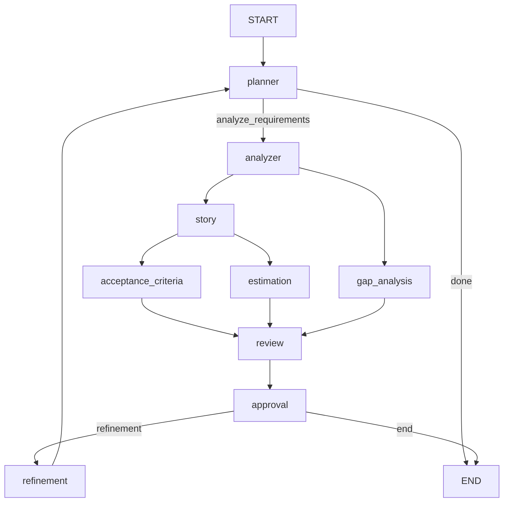

# BA Copilot V3 — LangGraph Agentic Workflow

**V3** is a production-ready, graph-based Business Analyst AI system built on **LangGraph** with checkpointing, conditional routing, tool-calling agents, and an iterative refinement loop.

---

## 🧠 Workflow



| # | Node | Agent | Tools | Output |
|---|------|-------|-------|--------|
| 1 | `planner` | `planner_agent` | — | `PlanOutput` (next_step, reason) |
| 2a | `analyzer` | `analyzer_agent` | `retrieve_similar_brd` | `AnalysisOutput` (actors, modules, requirements) |
| 2b | `gap_analysis` | `gap_agent` | — | `GapOutput` (gaps_found, gaps) |
| 3 | `story` | `story_agent` | — | `StoryOutput` (user_stories — plain strings) |
| 4a | `acceptance_criteria` | `acceptance_agent` | — | `AcceptanceOutput` (Given/When/Then per story) |
| 4b | `estimation` | `estimation_agent` | `calculate_story_points` | `EstimationOutput` (stories with points) |
| 5 | `review` | `review_agent` | — | `ReviewOutput` (quality_score, strengths, weaknesses, recommendations) |
| 6 | `approval` | — (interrupt) | — | Human-in-the-loop decision; routes to `refinement` or `END` |
| 7 | `refinement` | `refinement_agent` | — | `RefinementOutput` (improvements, final_summary) |

### Key Design Principles

- **One agent = one task**: Story agent writes stories only; acceptance criteria agent writes Given/When/Then only; estimation agent scores points only. No agent does double duty.
- **Parallel fan-out**: After stories, acceptance criteria and estimation run simultaneously — both feed into review.
- **Planner is context-aware**: On refinement loops, the planner sees review feedback + refinement changes, enabling smart re-routing.
- **Approval router**: Handles multiple interrupts via a `while` loop in `main.py`. Exits on approval or `max_iterations` cap.
- **Gap analysis with full context**: Receives both `{requirement}` and `{analysis}` for accurate comparison (not just analysis).
- **Pydantic validation with auto-retry**: All agents use `invoke_with_validation` — bad JSON triggers retry with error feedback. Uses `Literal` types where appropriate.
- **MCP integration**: Resources (standards) cached via `resource_cache.py`; tools (BRD retrieval, story points) called via `client_wrapper.py`.
- **Msgpack model registration**: All Pydantic models registered for checkpoint serialization via `JsonPlusSerializer().with_msgpack_allowlist()`.

---

## 🗂️ Project Structure

```
BA_Copilot_V3/
├── main.py                  # Entry point — streaming loop + multi-interrupt approval
├── state.py                 # BAState TypedDict (shared graph state)
├── graph/
│   └── graph.py             # LangGraph StateGraph + checkpointing + msgpack registration
├── agents/                  # Agent functions (invoke + validate)
│   ├── planner_agent.py
│   ├── analyzer_agent.py    # ← ReAct agent: retrieve_similar_brd tool
│   ├── gap_agent.py
│   ├── story_agent.py
│   ├── acceptance_agent.py  # ← writes Given/When/Then per story
│   ├── estimation_agent.py  # ← ReAct agent: calculate_story_points tool
│   ├── review_agent.py
│   └── refinement_agent.py
├── nodes/                   # Graph node functions (load prompt → call agent)
│   ├── planner_node.py
│   ├── analyzer_node.py
│   ├── gap_node.py
│   ├── story_node.py
│   ├── acceptance_node.py   # ← fetches acceptance_standard from MCP
│   ├── estimation_node.py
│   ├── review_node.py
│   ├── approval_node.py
│   └── refinement_node.py
├── routers/                 # Conditional edge logic
│   ├── planner_router.py    # ← fallback guard against bad LLM values
│   └── approval_router.py   # ← explicit is True check
├── models/                  # Pydantic output schemas
│   ├── plan.py              # ← Literal["analyze_requirements", "done"]
│   ├── analysis.py
│   ├── gaps.py
│   ├── story.py
│   ├── acceptance.py        # ← StoryCriteria + AcceptanceOutput
│   ├── estimation.py        # ← StoryEstimate with validation_alias
│   ├── review.py
│   └── refinement.py
├── prompts/                 # Prompt templates (loaded by nodes)
│   ├── planner.txt          # ← context-aware: sees iteration + review + refinement
│   ├── analyzer.txt
│   ├── gap.txt              # ← receives both requirement AND analysis
│   ├── story.txt            # ← explicit format example, no ACs
│   ├── acceptance_criteria.txt
│   ├── estimate_stories.txt
│   ├── review.txt           # ← reviews all 5 artifacts
│   └── refinement.txt       # ← refines all 5 artifacts
├── llm/                     # LLM provider (DeepSeek via OpenAI-compatible)
│   ├── deepseek_provider.py
│   ├── provider_factory.py  # ← static method (no instantiation needed)
│   └── settings.py
├── tools/
│   └── retriever.py         # Sync @tool wrappers → MCP client
├── mcp_client/              # FastMCP client for BA MCP Server
│   ├── __init__.py          # get_server_target() — stdio or HTTP
│   ├── client_wrapper.py    # Per-call short-lived MCP subprocess
│   ├── resource_cache.py    # Thread-safe cached resource fetcher with logging
│   └── test_without_agent.py
├── utils/
│   ├── invoke_with_validation.py   # Retry + structured validation
│   ├── append_validation_feedback.py
│   ├── json_parser.py
│   └── prompt_loader.py
├── document/
│   └── document_processor.py       # .txt / .pdf / .docx reader
├── input/
│   └── requirement.txt             # Place input files here
├── output/                         # Generated BA reports
│   └── ba_report_*.json
├── ARCHITECTURE.md                 # Detailed architecture document
├── requirements.txt
└── .env                    # DEEPSEEK_API_KEY, MODEL_NAME, etc.
```

---

## 🔧 Key Design Patterns

### Agent pattern (shared by all agents)

```
invoke_with_validation(invokable, payload, model_class)
  → invokable.invoke(payload)
  → parse_llm_json(response)
  → model_validate(json)
  → on failure: append error to payload, retry up to 2 times
```

- **Planner / Gap / Story / Acceptance / Review / Refinement**: stateless `llm.invoke(prompt)` — no tools needed.
- **Analyzer**: stateful `create_agent(model=llm, tools=[retrieve_similar_brd])` — ReAct agent loop with MCP tool calling.
- **Estimation**: stateful `create_agent(model=llm, tools=[calculate_story_points])` — scores each story via MCP.

### Router pattern

```python
# planner_router.py — validates + falls back
_VALID_STEPS = {"analyze_requirements", "done"}
def planner_router(state):
    step = state["plan"].next_step   # Literal-validated by Pydantic
    return step if step in _VALID_STEPS else "done"

# approval_router.py — explicit boolean check
def approval_router(state):
    if state.get("approved") is True:
        return "end"
    if state.get("iteration", 0) >= state.get("max_iterations", 3):
        return "end"
    return "refinement"
```

### Checkpointing

SQLite-backed via `SqliteSaver` — enables pause/resume, state inspection, and replay with the same `thread_id`.

---

## � Sample Log Output

```
17:33:00 [INFO] root: Starting workflow...
17:33:01 [DEBUG] mcp_client.resource_cache: CACHE MISS -> ba://story_standard
17:33:02 [INFO] mcp_client.resource_cache: [MCP] CACHED -> ba://story_standard (100 chars)

[NODE] planner
[NODE] analyzer
[NODE] story

17:33:05 [DEBUG] mcp_client.resource_cache: CACHE MISS -> ba://acceptance_standard
17:33:05 [INFO] mcp_client.resource_cache: [MCP] CACHED -> ba://acceptance_standard (250 chars)

[NODE] acceptance_criteria
[NODE] estimation
[NODE] gap_analysis
[NODE] review
[NODE] approval

Approval BA Report? (y/n): n
User approval: n

[NODE] refinement
[NODE] planner
[NODE] analyzer
[NODE] story

17:33:12 [DEBUG] mcp_client.resource_cache: CACHE HIT -> ba://story_standard
17:33:12 [DEBUG] mcp_client.resource_cache: CACHE HIT -> ba://acceptance_standard

[NODE] acceptance_criteria
[NODE] estimation
[NODE] gap_analysis
[NODE] review
[NODE] approval

Approval BA Report? (y/n): y
User approval: y

Report saved to: output/ba_report_20260806_120319.json
```

> **Key observations:** Resource cache works (CACHE MISS → CACHE HIT on second pass). Refinement loop re-runs full pipeline. All 9 nodes execute in order.

---

## �🚀 Getting Started

### 1. Setup

```bash
cd BA_Copilot_V3
python -m venv .venv
.venv\Scripts\activate     # Windows
pip install -r requirements.txt
```

### 2. Configure

Create `.env` in `BA_Copilot_V3/`:

```env
MODEL_PROVIDER=deepseek
MODEL_NAME=deepseek-chat
DEEPSEEK_API_KEY=sk-...
DEEPSEEK_BASE_URL=https://api.deepseek.com
```

### 3. Add input

Edit `input/requirement.txt` with your requirement document. Supports `.txt`, `.pdf`, `.docx`.

### 4. Run

```bash
python main.py
```

---

## 📊 Sample Input → Output

### Input (`input/requirement.txt`)

```
Build a customer portal where users can:

- Register
- Login
- View Orders
- Download Invoices
```

### Output (console)

```
Event: {'planner': {'plan': PlanOutput(next_step='analyze_requirements')}}

Event: {'analyze_requirements': {'analysis': AnalysisOutput(
    actors=['Customer', 'System Administrator'],
    modules=['User Registration', 'Authentication', 'Order Management', 'Invoice Management'],
    requirements=[
        'The system shall allow new users to register for a customer portal account.',
        'The system shall allow registered users to log in to the customer portal.',
        'The system shall allow authenticated users to view their orders.',
        'The system shall allow authenticated users to download their invoices.',
    ]
)}}

...

RESULT
==================================================
{'requirement': 'Build a customer portal where users can: ...',
 'plan': PlanOutput(next_step='analyze_requirements'),
 'analysis': AnalysisOutput(actors=[...], modules=[...], requirements=[...]),
 'stories': StoryOutput(user_stories=[
     'As a customer, I want to register an account so that I can access the portal.',
     ...
 ]),
 'gaps': GapOutput(gaps_found=False, gaps=[]),
 'review': ReviewOutput(quality_score=8, strengths=[...], weaknesses=[...], recommendations=[...]),
 'approved': True}
```

---

## 🔄 Iterative Refinement

If `approved=False`, the workflow routes to `refinement` instead of `END`. The refinement agent consumes all 4 artifacts (analysis, stories, gaps, review) and produces improvements. The approval router caps iterations to prevent infinite loops.

---

## 🆚 V2 vs V3

| Feature | V2 | V3 |
|--------|----|----|
| Workflow engine | LangGraph | LangGraph |
| Agent pattern | Per-node LLM calls | Shared `invoke_with_validation` + retry |
| Tools | Analyzer only | Analyzer only (ReAct agent) |
| Planner | Fixed linear | Dynamic router (analyzer / gap / done) |
| Refinement loop | Manual | Automatic via approval router |
| State | TypedDict | TypedDict with all outputs |
| Checkpointing | SQLite | SQLite |
| Prompt management | `.txt` templates | `.txt` templates |
