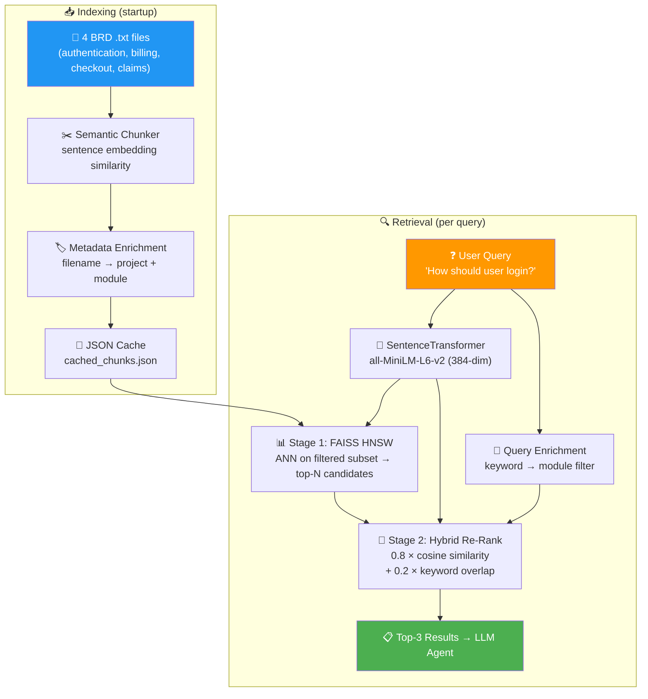

# BA MCP Server — Business Analyst Tools & Knowledge

A [FastMCP](https://gofastmcp.com) server providing tools, resources, and RAG-powered BRD knowledge retrieval for business analysis workflows. Used by **BA Copilot V3** as the tool backend.

---

## 🧠 RAG Pipeline (Two-Stage Retrieval)

The `retrieve_similar_brd` tool is powered by a custom RAG engine — not mock data.



### How It Works

| Stage | Component | Stack | Function |
|---|---|---|---|
| **Chunking** | `chunker.py` | SentenceTransformer + sklearn | Splits docs where meaning shifts (cosine < 0.5); merges undersized chunks |
| **Metadata** | `metadata_store.py` | Custom keyword mapping | Tags chunks by domain module; enriches queries for pre-filtering |
| **Embedding** | `embeddings.py` | `all-MiniLM-L6-v2` | 384-dim dense vectors; shared instance for chunking + retrieval |
| **Stage 1** | `vector_store.py` + `retriever.py` | FAISS IndexHNSWFlat | Approximate nearest neighbor — fast candidate retrieval from filtered subset |
| **Stage 2** | `hybrid_search.py` | Cosine + word-overlap | Re-ranks candidates combining semantic (80%) and lexical (20%) signals |
| **Caching** | `rag_engine.py` | JSON + mtime check | Chunk cache auto-invalidates when source .txt files are edited |

---

## 📚 Knowledge Base

| File | Domain | Topics |
|---|---|---|
| `customer_portal_authentication.txt` | IAM | Registration, login, MFA, SSO, RBAC, password policy, session management |
| `customer_portal_billing.txt` | Payments | Payment methods, subscriptions, invoicing, refunds, PCI-DSS, multi-currency |
| `ecommerce_checkout.txt` | E-Commerce | Cart, checkout flow, shipping, returns, order management, fraud detection |
| `insurance_claims.txt` | Insurance | FNOL, triage, investigation, settlement, fraud detection, compliance |

---

## 🛠️ Tools

| Tool | Description |
|---|---|
| `retrieve_similar_brd` | RAG-powered BRD retrieval — two-stage FAISS + hybrid re-rank |
| `calculate_story_points` | Maps complexity to Fibonacci story points (`low`→2, `medium`→5, `high`→8, `very_high`→13) |
| `load_requirement` | Loads a requirement document from the filesystem |

---

## 📦 Resources

- BA standards and checklists
- Prompt templates for user story generation and requirement review

---

## 🚀 Getting Started

```bash
cd BA_MCP_Server
python -m venv .venv
.venv\Scripts\Activate.ps1       # Windows
pip install -r requirements.txt

# Run as standalone server (stdio transport)
python server.py

# Or use FastMCP CLI
fastmcp run server.py
```

---

## 🔗 Usage with BA Copilot V3

```python
from fastmcp import Client

client = Client("BA_MCP_Server/server.py")
async with client:
    result = await client.call_tool("retrieve_similar_brd", {"requirement": "payment refund policy"})
    print(result.content[0].text)
```

See `BA_Copilot_V3/mcp_client/client_wrapper.py` for the production wrapper.

---

## 📁 Project Structure

```
BA_MCP_Server/
├── server.py                          # FastMCP entry point
├── requirements.txt                   # Python dependencies
├── README.md
│
├── rag/                               # RAG pipeline (two-stage retrieval)
│   ├── rag_engine.py                  #   Orchestrator — cache, filter, embed, search
│   ├── chunker.py                     #   Paragraph-based document splitter
│   ├── embeddings.py                  #   SentenceTransformer wrapper
│   ├── vector_store.py                #   FAISS HNSW index
│   ├── retriever.py                   #   FAISS ANN retrieval wrapper
│   ├── hybrid_search.py               #   Semantic + keyword re-ranker
│   ├── semantic_search.py             #   Cosine similarity
│   ├── keyword_search.py              #   Word-overlap scorer
│   ├── metadata_store.py              #   Query/document metadata enrichment
│   └── rag_retriever_test.py          #   Integration smoke test
│
├── knowledge_base/                    # BRD knowledge documents
│   ├── customer_portal_authentication.txt
│   ├── customer_portal_billing.txt
│   ├── ecommerce_checkout.txt
│   ├── insurance_claims.txt
│   └── cached_chunks.json             # Auto-generated chunk cache
│
├── tools/                             # MCP tool implementations
│   ├── retrieve_similar_brd.py        #   → uses rag_engine
│   ├── calculate_story_points.py
│   └── load_requirement.py
│
├── resources/                         # MCP resources (standards, checklists)
├── prompts/                           # MCP prompt templates
└── utils/                             # Shared utilities
```
