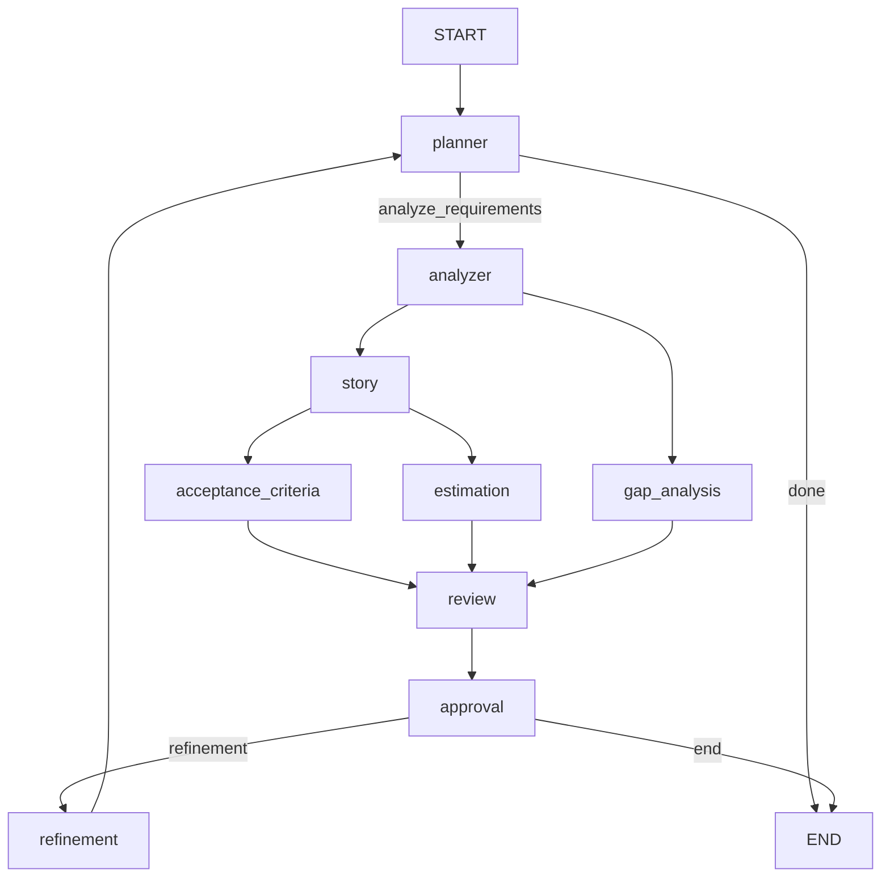
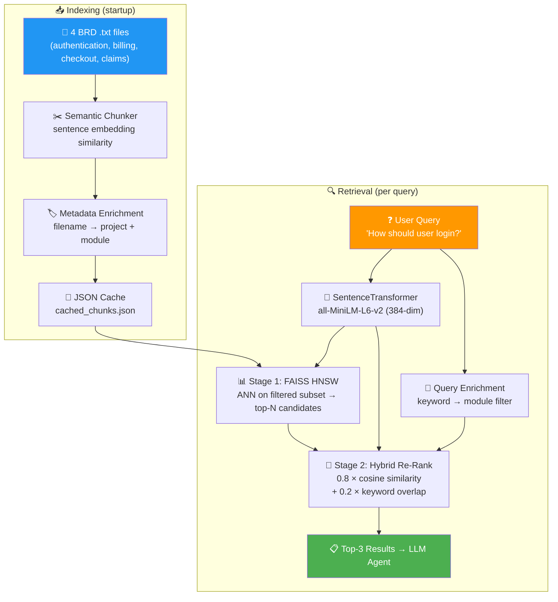

# BA Copilot — Agentic AI Business Analyst Assistant

**BA Copilot** is a multi-agent AI system that automates the full Business Analyst workflow. It ingests raw requirement documents (`.txt`, `.pdf`, `.docx`) and produces structured BA deliverables — analysis, user stories, gap analysis, quality review, and iterative refinements.

> Four components are provided:
> - **V1** — Stable, custom orchestration + Streamlit UI
> - **V2** — LangGraph-based with human-in-the-loop approval and SQLite checkpointing
> - **V3** ⭐ — **Current.** Production LangGraph workflow with planner routing, tool-calling agents, auto-retry validation, and iterative refinement loop
> - **BA MCP Server** — FastMCP server with RAG-powered BRD retrieval (FAISS + hybrid re-rank), story point estimation, and requirement loading tools

---

## 🧠 What It Produces

| Artifact | Description |
|---|---|
| **Analysis** | Actors, modules, and functional requirements extracted from raw input |
| **User Stories** | Standardized "As a … I want … so that …" format |
| **Acceptance Criteria** | Given‑When‑Then scenarios for each story |
| **Gap Analysis** | Missing information, ambiguities, edge cases, and clarification questions |
| **Effort Estimation** | Story points per story via dedicated estimation agent + MCP tool |
| **Quality Review** | 1–10 score with strengths, weaknesses, and recommendations |
| **Refinement** | Revised stories and a summary of changes based on review feedback |
| **Human Approval** | V2 pauses the graph for manual approve/refine decision (with iteration cap) |

---

## 🎯 Quick Start

### V3 ⭐ — LangGraph Production Workflow (Recommended)

```bash
cd BA_Copilot_V3
python -m venv .venv
.venv\Scripts\Activate.ps1          # Windows
pip install -r requirements.txt
cp .env.example .env                # then add your DEEPSEEK_API_KEY
python main.py                      # runs full workflow → output/ba_report_*.json
```

### V1 — Stable (Custom Orchestration + Streamlit UI)

```bash
cd BA_Copilot_V1
python -m venv .venv
.venv\Scripts\Activate.ps1          # Windows
pip install -r requirements.txt
python main.py                      # CLI – writes outputs/ba_report.json
streamlit run app.py                # Browser UI
```

### V2 — LangGraph (Human‑in‑the‑Loop + Checkpoints)

```bash
cd BA_Copilot_V2
python -m venv .venv
.venv\Scripts\Activate.ps1          # Windows
pip install -r requirements.txt
cp .env.example .env                # then add your DEEPSEEK_API_KEY
python main.py                      # interactive approval prompt
```

---

## 📦 Version Comparison

| Feature | V1 | V2 | V3 ⭐ |
|---|---|---|---|
| **Framework** | Custom sequential pipeline | LangGraph `StateGraph` | LangGraph `StateGraph` |
| **LLM Backend** | Mock provider (deterministic) | DeepSeek via OpenAI API | DeepSeek via OpenAI API |
| **Planner** | ❌ None | ❌ Fixed linear flow | ✅ Dynamic router (analyzer / gap / done) |
| **Agent Pattern** | One-shot LLM calls | One-shot LLM calls | Shared `invoke_with_validation` + auto-retry |
| **Tool-calling Agent** | ❌ | ❌ | ✅ ReAct agent with `retrieve_similar_brd` |
| **Parallelism** | ❌ Sequential only | ✅ Stories + Gap in parallel | ✅ Stories + Gap in parallel |
| **Refinement Loop** | ❌ Manual | ✅ Human-in-the-loop | ✅ Automatic approval router + iteration cap |
| **State** | Plain `WorkflowState` class | Typed `BAState` (TypedDict) | Typed `BAState` (TypedDict) with all outputs |
| **Persistence** | JSON file | SQLite checkpointing | SQLite checkpointing |
| **UI** | Streamlit (`app.py`) | CLI only | CLI only |
| **Status** | ✅ Stable | 🚧 Active Development | ⭐ **Current** |

---

## 🏗️ Architecture at a Glance

### V3 ⭐ — Planner-Routed LangGraph with Tool-Calling Agents



The **planner** dynamically routes based on the requirement. The **analyzer** is a ReAct agent with a BRD knowledge retrieval tool. **Story** and **gap_analysis** run in parallel after analysis. Stories fan out to **acceptance_criteria** (Given/When/Then per story) and **estimation** (story point scoring via MCP) — both run in parallel. All five artifacts converge at **review**. The **approval router** enables iterative refinement with a human-in-the-loop, looping back to **planner** until approved or max iterations reached.

<details>
<summary>📊 Sample V3 Log Output</summary>

```
17:33:00 [INFO] root: Starting workflow...
17:33:01 [DEBUG] mcp_client.resource_cache: CACHE MISS -> ba://story_standard
17:33:02 [INFO] mcp_client.resource_cache: [MCP] CACHED -> ba://story_standard (100 chars)

[NODE] planner
[NODE] analyzer
[NODE] story
[NODE] acceptance_criteria
[NODE] estimation
[NODE] gap_analysis
[NODE] review
[NODE] approval

Approval BA Report? (y/n): n
User approval: n

[NODE] refinement     → loops back to planner
[NODE] planner        → context-aware re-plan
[NODE] analyzer
[NODE] story

[NODE] acceptance_criteria
[NODE] estimation
[NODE] gap_analysis
[NODE] review
[NODE] approval

Approval BA Report? (y/n): y

Report saved to: output/ba_report_20260806_120319.json
```

</details>

### V1 — Linear Agent Pipeline

```
Requirement.txt  →  DocumentProcessor  →  Orchestrator
  ┌──────────────────────────────────────────────────────┐
  │ Analyzer → Stories → AcceptanceCriteria → GapAnalysis │
  │ → EffortEstimation → Review → Refinement              │
  └──────────────────────────────────────────────────────┘
                                                    →  ba_report.json
```

### V2 — LangGraph Graph with Fan‑Out / Fan‑In

```
START → retriever → analyze_requirements
                         ╱            ╲
                  build_stories    gap_analysis
                         ╲            ╱
                      prepare_review
                            │
                       review_output
                            │
                         approval ←── human interrupt
                          ╱    ╲
                       END    refinement_output ──→ prepare_review (loop)
```

---

## 🧠 RAG Pipeline (MCP Server)

The `retrieve_similar_brd` MCP tool uses a custom two-stage retrieval pipeline — semantic chunking, metadata filtering, FAISS HNSW ANN, and hybrid re-ranking.



| Stage | Component | Stack | Function |
|---|---|---|---|
| **Chunking** | `chunker.py` | SentenceTransformer + sklearn | Splits docs where meaning shifts (cosine < 0.5); merges undersized chunks |
| **Metadata** | `metadata_store.py` | Custom keyword mapping | Tags chunks by domain module; enriches queries for pre-filtering |
| **Embedding** | `embeddings.py` | `all-MiniLM-L6-v2` | 384-dim dense vectors; shared instance for chunking + retrieval |
| **Stage 1** | `vector_store.py` + `retriever.py` | FAISS IndexHNSWFlat | Approximate nearest neighbor — fast candidate retrieval from filtered subset |
| **Stage 2** | `hybrid_search.py` | Cosine + word-overlap | Re-ranks candidates combining semantic (80%) and lexical (20%) signals |
| **Caching** | `rag_engine.py` | JSON + mtime check | Chunk cache auto-invalidates when source .txt files are edited |

---

## 📂 Project Structure

```
ba-copilot/
├── README.md                       ← This file
│
├── BA_Copilot_V3/                  ⭐ Current — planner-routed LangGraph + tool-calling agents
│   ├── agents/                     │  7 agents (planner, analyzer, gap, story, estimation, review, refinement)
│   ├── nodes/                      │  8 graph nodes
│   ├── routers/                    │  planner_router + approval_router
│   ├── models/                     │  7 Pydantic output models
│   ├── prompts/                    │  7 prompt templates (.txt)
│   ├── llm/                        │  DeepSeek provider (OpenAI-compatible)
│   ├── tools/                      │  retriever (BRD + story points via MCP)
│   ├── mcp_client/                 │  FastMCP client wrapper for BA MCP Server
│   ├── utils/                      │  invoke_with_validation, json_parser, prompt_loader
│   ├── document/                   │  Multi-format document processor
│   ├── graph/                      │  StateGraph definition + checkpointing
│   ├── input/                      │  Place requirement.txt/.pdf/.docx here
│   ├── output/                     │  Generated ba_report_*.json reports
│   ├── main.py                     │  Entry point
│   ├── state.py                    │  BAState TypedDict
│   ├── requirements.txt
│   └── README.md
│
├── BA_Copilot_V1/                  ← Stable: custom orchestration + Streamlit
│   ├── agents/                     │  7 specialty agents (analyzer, stories, etc.)
│   ├── core/                       │  LLM provider abstraction & mock provider
│   ├── document/                   │  Multi‑format document processor
│   ├── prompts/                    │  7 prompt templates (.txt)
│   ├── workflow/                   │  Orchestrator + WorkflowState
│   ├── samples/                    │  Sample input files
│   ├── outputs/                    │  Generated ba_report.json
│   ├── app.py                      │  Streamlit web UI
│   ├── main.py                     │  CLI entry point
│   ├── ARCHITECTURE.MD             │  Detailed architecture docs
│   └── README.md
│
├── BA_Copilot_V2/                  ← LangGraph: human‑in‑the‑loop + checkpoints
│   ├── nodes/                      │  8 graph nodes (retriever, analyzer, …)
│   ├── routers/                    │  Conditional routing (approval_router)
│   ├── models/                     │  Pydantic data models
│   ├── tools/                      │  Retriever stub (RAG‑ready)
│   ├── utils/                      │  JSON parser & prompt loader
│   ├── llm/                        │  Provider factory (DeepSeek + Ollama stub)
│   ├── document/                   │  Multi‑format document processor
│   ├── prompts/                    │  7 prompt templates (.txt)
│   ├── input/                      │  Input requirement files
│   ├── state.py                    │  BAState TypedDict
│   ├── graph.py                    │  StateGraph builder + SQLite checkpointer
│   ├── main.py                     │  Entry point (stream + interrupt + resume)
│   ├── .env.example                │  Environment template
│   └── README.md
│
├── BA_MCP_Server/                  ← FastMCP server with RAG-powered BRD retrieval
│   ├── server.py                   │  FastMCP server entry point
│   ├── requirements.txt            │  Python dependencies (fastmcp, FAISS, sentence-transformers)
│   ├── rag/                        │  Two-stage RAG pipeline (chunker, embeddings, FAISS, hybrid)
│   ├── knowledge_base/             │  4 BRD domain documents + auto-generated JSON cache
│   ├── tools/                      │  retrieve_similar_brd (→ rag_engine), calculate_story_points, load_requirement
│   ├── resources/                  │  BA standards, checklists, templates
│   ├── prompts/                    │  Prompt templates (user stories, review)
│   ├── utils/                      │  Shared utilities
│   └── README.md
│
└── .gitignore
```

---

## 🚀 Workflow

Both V1 and V2 follow the same logical flow:

```
Requirement
  ↓
Retriever (extracts context)
  ↓
Analyzer (identifies actors, modules, requirements)
  ↓
Story Generator (creates user stories)
  ↓
Reviewer (evaluates quality)
  ↓
[APPROVAL INTERRUPT] (V2 only)
  ↓
Refinement (improves based on review)
  ↓
BA Report Output
```

---

## 🔄 V2 Approval Workflow

V2 adds human-in-the-loop approval between review and refinement:

1. **Stream execution** — workflow runs via `graph.stream()` yielding events
2. **Detect interrupt** — approval node calls `interrupt()` and pauses
3. **Get state** — retrieve workflow state with `graph.get_state(config)`
4. **User input** — prompt for approval decision
5. **Resume** — continue with `graph.invoke(Command(resume=approved), config=config)`
6. **Persist** — SQLite checkpoint preserves state across sessions

---

## 🛠️ Development

### Adding New Nodes (V2)

Create a new node file in `nodes/`:

```python
from state import BAState

async def my_node(state: BAState) -> dict:
    """Process state and return updates."""
    # Your logic here
    return {"key": value}
```

Add to graph in `graph.py`:

```python
builder.add_node('my_node', my_node)
builder.add_edge('previous_node', 'my_node')
```

### Adding Conditional Routing (V2)

Create a router in `routers/`:

```python
def my_router(state: BAState) -> str:
    if condition:
        return "node_a"
    return "node_b"

# In graph.py:
builder.add_conditional_edges('source_node', my_router)
```

---

## 📝 Configuration

### Input Files

- **V1**: `samples/requirement.txt`
- **V2**: `samples/requirement.txt`

Modify `main.py` to use different input sources.

### LLM Provider (V2)

Update in `state.py` or environment:

```python
# Use OPENAI_API_KEY or other provider via core/provider_factory.py
```

---

## 🔐 Environment Isolation

**Important**: Each version uses its own virtual environment:

- `BA_Copilot_V1/.venv` — V1 dependencies only
- `BA_Copilot_V2/.venv` — V2 dependencies (LangGraph, etc.)

Never install V2 packages into V1's `.venv` or vice versa. Both folders are git-ignored for safety.

---

## 📖 Documentation

- [V1 README](./BA_Copilot_V1/README.md) — Setup and usage for stable version
- [V2 README](./BA_Copilot_V2/README.md) — LangGraph, checkpoints, and approval workflow

---

## 👤 Author

Suhail Riyaz  
Agentic AI Enthusiast

---

## 📄 License

[Add license information if applicable]
