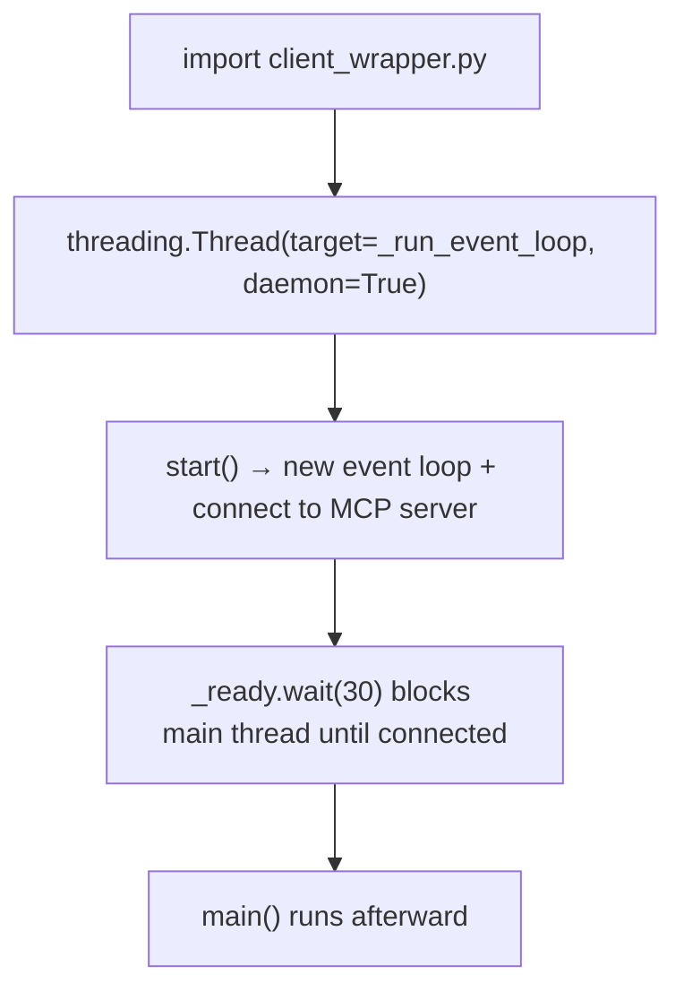
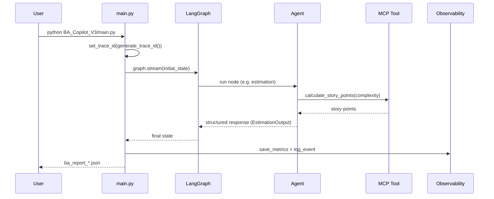
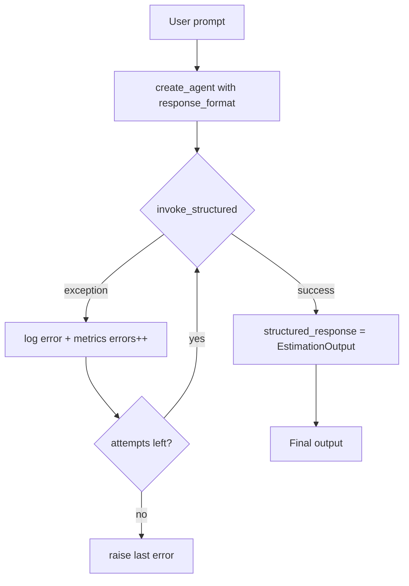

# BA Copilot V3 — Runtime Architecture (Layer by Layer)

This document walks through the application from the moment it starts to the moment it
returns a result, one layer at a time. It is written so a third person who has never seen
the code can understand the flow, and so a future developer can use it as a revision guide.

Companion documents: `README.md` (overview) and `BA_Copilot_V3/ARCHITECTURE.md` (the
LangGraph graph and state model).

---

## 1. Entry Point Layer

**Where it starts:** `BA_Copilot_V3/main.py`, function `main()` (guarded by
`if __name__ == "__main__"`).

Initialization happens in this order:

1. **Import bootstrap** — `sys.path.insert(0, project_root)` is done first, so the shared
   `observability/` package (which lives at the repo root) is importable before any other
   module touches it.
2. **Logging setup** — `logging.basicConfig(...)` and silencing of noisy third-party
   loggers (`httpx`, `openai`, `langchain`, `langgraph`).
3. **Input** — `DocumentProcessor` extracts text from `input/requirement.txt`.
4. **Run config** — a `config` dict carries `thread_id` (used by SQLite checkpointing).
5. **Trace id** — `generate_trace_id()` + `set_trace_id(...)` marks the start of one
   observable run.
6. **Graph execution** — `graph.stream(initial_state, config=config)`.
7. **Human-in-the-loop** — an approval loop calls `graph.invoke(Command(resume=...))`
   until the workflow ends.
8. **Output** — metrics snapshot is saved, the BA report is written to
   `output/ba_report_<timestamp>.json`, and the graph is rendered to PNG.

---

## 2. Thread Management Layer

The application uses three kinds of threads, each with a distinct purpose.

| Thread | Where | Purpose |
|---|---|---|
| Main thread | `main.py` | Runs the graph and the approval loop |
| Worker pool | LangGraph internals | Runs graph nodes, with parallel fan-out |
| Daemon thread | `mcp_client/client_wrapper.py` | Hosts a dedicated asyncio event loop for the MCP client |

**The daemon thread (MCP connection):**



Key facts:

- The daemon thread starts **at import time**, before `main()` runs.
- It owns the single persistent MCP client and one event loop for the whole process.
- Tool calls are submitted to that loop with `run_coroutine_threadsafe()`, so many
  parallel calls share one server connection.
- Because the daemon thread starts before the trace id is set, it has its own context:
  the trace id must be **captured in the calling thread and passed explicitly** (see
  Layer 6).

`mcp_client/resource_cache.py` additionally uses a `threading.Lock` with a
double-checked-locking pattern to safely cache MCP resources across threads.

---

## 3. Agent Layer

Agents live in `BA_Copilot_V3/agents/`. Every agent selects its LLM through
`ProviderFactory.get_llm()` (DeepSeek via an OpenAI-compatible API).

There are two agent shapes:

| Shape | Agents | Invocation | Tools |
|---|---|---|---|
| Stateless | planner, gap, story, acceptance, review, refinement | `llm` + string prompt | none |
| Tool-calling (ReAct) | analyzer, estimation | `create_agent(model, tools=[...])` | yes |

**The estimation agent** demonstrates both tool-calling and structured output:

```python
agent = create_agent(
    model=llm,
    tools=[calculate_story_points],   # intermediate ReAct tool calls (MCP)
    response_format=EstimationOutput, # final answer must match this Pydantic model
)
```

- `tools` lets the LLM call `calculate_story_points` to map complexity to story points.
- `response_format` forces the final answer to conform to `EstimationOutput`, so the
  response is already a validated model instead of free text.

---

## 4. Invocation Layer

Two helpers wrap the actual LLM/agent call. They live in `BA_Copilot_V3/utils/`.

### `invoke_with_validation` (free-text agents)

```
invoke → extract text → parse JSON → model_validate
                    ↓ on error
          append validation feedback to payload → retry (up to N)
```

Used by the stateless agents, which return free text that must be parsed and validated.

### `invoke_structured` (structured-output agents)

```
invoke → result["structured_response"]  (already a validated model)
       ↓ on exception
          increment "errors" + log_event(error) → retry (up to N) → re-raise last error
```

Used by the estimation agent. There is no JSON parsing or validation step, because the
LLM is already constrained to the model by `response_format`.

---

## 5. Application Flow Layer

End-to-end flow of one workflow run:



Per-agent flow, including retry handling:



---

## 6. Observability Layer

The `observability/` package (shared by V3 and the MCP server) provides three pillars.

### Trace id

- `context.py` holds `current_trace_id` as a `ContextVar`.
- Set once per run in `main.py`; propagated to worker threads by the executor copying the
  context at submit time.
- Crossed to the MCP server **explicitly** as a `trace_id` tool argument, then re-set at
  the top of each server tool.

### Structured logs

- `logger.py` exposes `log_event(component, message, duration_ms=None, level="info")`.
- Each call appends one JSON line to `observability/logs/ba_copilot.log`:

```json
{"time": "...", "trace_id": "...", "level": "info", "component": "rag", "message": "hybrid results: 3", "duration_ms": 1362.32}
```

- The file handler (not stdout) is what makes server-side logs visible — the MCP
  server's stdout belongs to the JSON-RPC transport.

### Metrics

- `metrics.py` — a thread-safe `Metrics` class (`defaultdict` + `Lock`).
- `metrics_registry.py` — a singleton `metrics` plus `save_metrics(file_name)`, anchored
  to `__file__` so CWD doesn't matter.
- Each process persists its own snapshot:
  - V3 client → `observability/metrics/v3_metrics.json`
  - MCP server → `observability/metrics/mcp_metrics.json`
- `dashboard.py` merges both files into one view.

---

## 7. Resilience Strategy

### Old strategy — validation feedback (free text)

The LLM was asked for JSON, but often returned a markdown table or an empty object.
`invoke_with_validation` parsed it, failed Pydantic validation, appended the error to the
prompt, and retried. Each retry **re-ran the entire ReAct loop**, doubling the tool calls
(8 stories × 2 attempts = 16 `calculate_story_points` calls per run).

### New strategy — exception handling (structured output)

`response_format=EstimationOutput` binds the model to a JSON schema, so the LLM **cannot**
emit a markdown table or a missing field. The frequent JSON-shape failure simply stops
existing.

What remains are rare exceptions (network, parser, tool errors), handled by
`invoke_structured` with a plain retry — no feedback loop, because there is no validation
error left to feed back.

| | Old (`invoke_with_validation`) | New (`invoke_structured`) |
|---|---|---|
| Input | free text | structured output |
| Frequent failure | wrong JSON shape | (eliminated) |
| Retry trigger | validation error | any exception |
| Feedback to LLM | appends error | none needed |
| Side effect | tool calls doubled | none |

---

## File Map (quick reference)

| Layer | Files |
|---|---|
| Entry point | `BA_Copilot_V3/main.py` |
| Threads / MCP | `BA_Copilot_V3/mcp_client/client_wrapper.py`, `resource_cache.py` |
| Agents | `BA_Copilot_V3/agents/*.py` |
| Invocation | `BA_Copilot_V3/utils/invoke_with_validation.py`, `invoke_structured.py` |
| Models | `BA_Copilot_V3/models/*.py` |
| Observability | `observability/context.py`, `trace.py`, `logger.py`, `metrics.py`, `metrics_registry.py`, `dashboard.py` |
| Server tools | `BA_MCP_Server/tools/*.py` |
