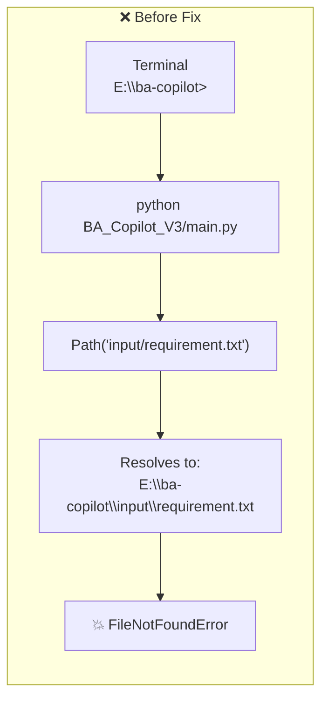
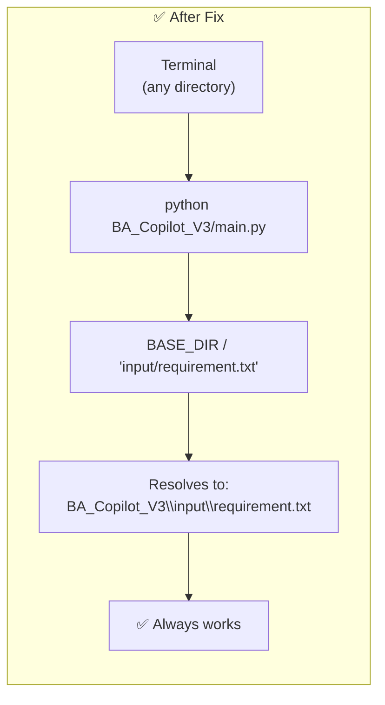

# Challenge 1: Relative Path Hell — CWD Dependency

## The Problem

Every component in the project used bare relative paths like `Path("knowledge_base")` or `"output/ba_report.json"`. These resolved relative to **where the command was typed** (CWD), not relative to the file that needed them.

## Root Cause

`Path("something")` is always relative to `os.getcwd()`, which is wherever the terminal happens to be. Running the same script from different directories produced different results — or crashes.

## Files Affected

| File | Broken Path | Fixed Path |
|---|---|---|
| `BA_MCP_Server/rag/rag_engine.py` | `Path("knowledge_base")` | `Path(__file__).parent.parent / "knowledge_base"` |
| `BA_Copilot_V3/main.py` | `"input/requirement.txt"` | `BASE_DIR / "input/requirement.txt"` |
| `BA_Copilot_V3/main.py` | `"output/ba_report_*.json"` | `BASE_DIR / "output" / f"ba_report_{ts}.json"` |
| `BA_Copilot_V3/main.py` | `"ba_copilot_graph.png"` | `BASE_DIR / "ba_copilot_graph.png"` |
| `BA_Copilot_V3/graph/graph.py` | `"ba_copilot_v3.db"` | `BASE_DIR / "ba_copilot_v3.db"` |
| `BA_Copilot_V3/utils/prompt_loader.py` | `Path("prompts")` | `Path(__file__).parent.parent / "prompts"` |

## The Fix

Every path is now anchored to `Path(__file__).parent` (or `.parent.parent`), so it resolves relative to the **file's own location**, not the terminal's CWD.

## Key Takeaway

> Always anchor filesystem paths to `__file__`, never to CWD. What works on your machine today will break on a colleague's tomorrow — or when run from a different terminal.
