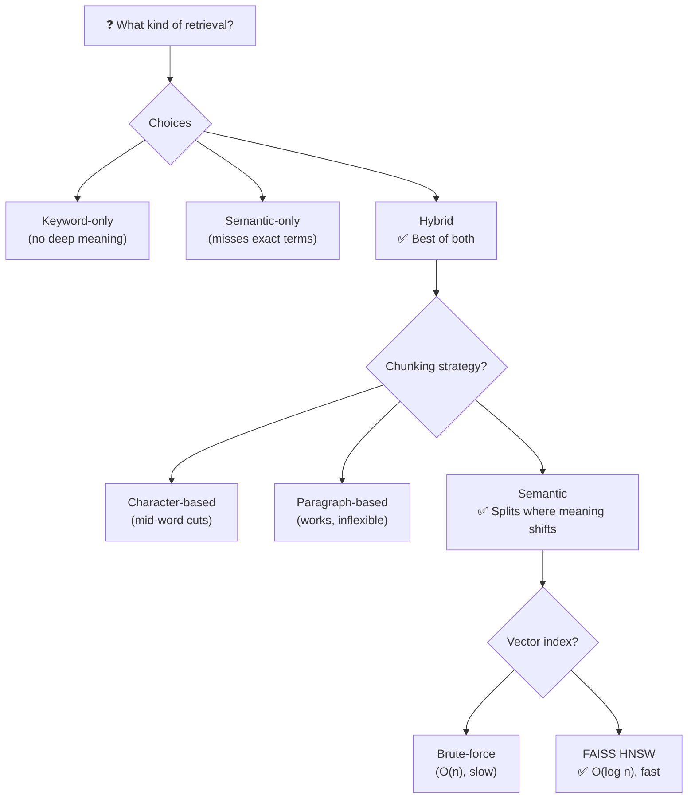
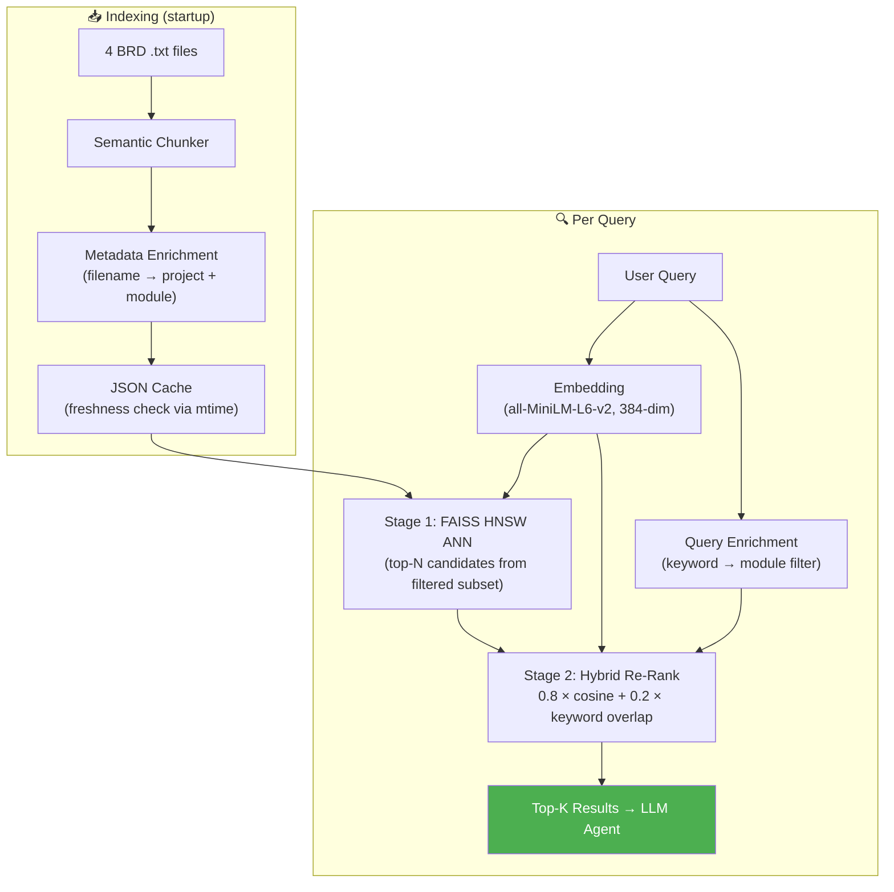

# Challenge 2: Building a RAG Pipeline from Scratch

## The Problem

The MCP server's `retrieve_similar_brd` tool was backed by a hardcoded Python dictionary — 4 topics with 5 bullet points each. To make it useful for real BA workflows, it needed to retrieve relevant context from full BRD documents using semantic search.

## Design Decisions

## Chunking Evolution

| Version | Strategy | Chunks (4 files) | Quality |
|---|---|---|---|
| V1 | Character-based (100 chars, 20 overlap) | 331 | `"equirements"` — mid-word cuts |
| V2 | Paragraph-based (`\n\n` split) | 69 | Clean sections, headers preserved |
| V3 | Semantic (sentence embedding similarity) | ~69 | Splits where meaning shifts, merges undersized |

The semantic chunker uses `SentenceTransformer` to compare consecutive sentences. When cosine similarity drops below 0.5, a new chunk boundary is created.

## Two-Stage Retrieval Architecture

### Why Two Stages?

Running hybrid scoring (cosine + keyword) against all chunks is O(n). FAISS narrows the field to top-50 candidates in O(log n), then hybrid scoring re-ranks only those. At scale (100k+ chunks), this is the difference between milliseconds and seconds.

## Component Stack

| Layer | Technology | Purpose |
|---|---|---|
| Chunking | SentenceTransformer + sklearn | Split documents where meaning shifts |
| Metadata | Custom keyword mapping | Pre-filter by domain module before vector search |
| Embedding | `all-MiniLM-L6-v2` (384-dim) | Dense vector representations |
| Vector Index | FAISS IndexHNSWFlat | Approximate Nearest Neighbor search |
| Re-Ranking | Cosine similarity + word overlap | 80% semantic + 20% lexical scoring |
| Caching | JSON + `st_mtime` check | Auto-invalidate when source files change |

## Key Takeaway

> A production RAG pipeline is not just "embed and search." It's a layered system: chunking strategy → metadata pre-filtering → ANN candidate retrieval → hybrid re-ranking. Each layer addresses a different failure mode.
