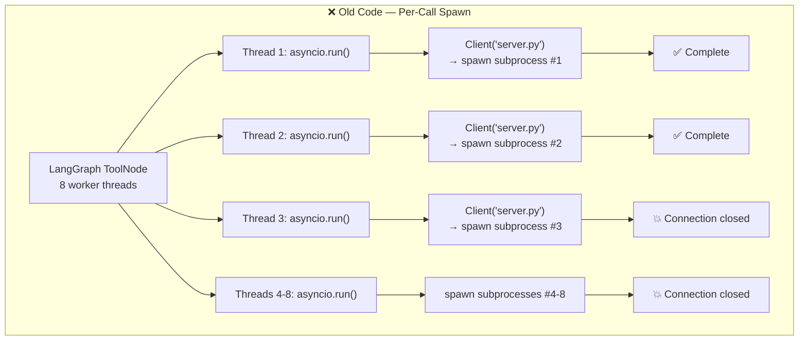
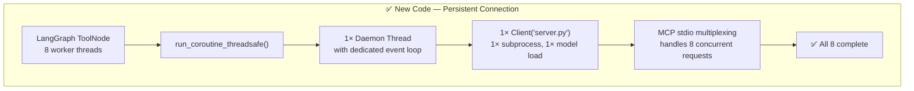

# Challenge 3: MCP Subprocess Race Condition

## The Problem

The V3 LangGraph workflow crashed with `McpError: Connection closed` whenever the estimation agent called `calculate_story_points` in parallel for multiple user stories.

## What Was Happening

LangGraph's `ToolNode` uses `ThreadPoolExecutor.map()` to run tool calls concurrently. When the LLM returned 8 story estimation calls in one message, 8 threads tried to call the MCP server simultaneously.



### Why It Failed

1. Each `asyncio.run()` created a **new event loop**, spawned a **new `python server.py` subprocess**, and loaded SentenceTransformer (80MB) from scratch
2. 8 subprocesses starting simultaneously caused resource contention — some completed the MCP handshake, others died mid-startup
3. The server was never designed to handle multiple process instances fighting for resources

Additionally, every call imported the full `tools/__init__.py`, which eagerly imported `retrieve_similar_brd` → `RAGEngine` → `SentenceTransformer`, even for the trivial `calculate_story_points` dict lookup.

## The Fix: Persistent Client with Dedicated Event Loop



### Architecture

```
LangGraph Thread Pool          Daemon Event Loop Thread         MCP Server Subprocess
(8 plain threads)              (1 asyncio loop)                 (1 python process)
      │                              │                              │
      │  run_coroutine_threadsafe    │                              │
      ├─────────────────────────────>│  "run this async function"   │
      │                              ├─────────────────────────────>│  call_tool(...)
      │  (blocked, waiting)          │                              │
      │                              │         result               │
      │                              │<─────────────────────────────│
      │         result               │                              │
      │<─────────────────────────────│                              │
```

### Key Implementation Detail

The daemon thread is started at **module import time** — before any tool function is called:

```python
# Runs when Python first imports client_wrapper.py
_thread = threading.Thread(target=_run_event_loop, daemon=True)
_thread.start()
_ready.wait(timeout=30)  # Block until server is connected
```

The event loop is kept alive indefinitely with `await asyncio.Event().wait()` — an awaitable that never resolves, keeping the loop running until interpreter shutdown.

Thread safety is achieved via `asyncio.run_coroutine_threadsafe()`, which bridges LangGraph's plain worker threads into the single event loop.

## Before vs After

| Metric | Before (per-call spawn) | After (persistent) |
|---|---|---|
| Server processes | 8 per estimation run | 1 total |
| Model loads | 8 × 80MB = 640MB | 1 × 80MB |
| Per-call latency | ~26s (cold start + model load) | ~30ms (just the ANN search) |
| Parallel safety | ❌ Race condition | ✅ MCP multiplexing |
| Cache reuse | None (dies with process) | Full (server stays alive) |

## Key Takeaway

> Don't spawn a new process/connection for every request. The MCP stdio transport is designed for persistent, multiplexed connections. Pair it with `run_coroutine_threadsafe` when the calling framework (LangGraph) uses thread pools instead of asyncio.
