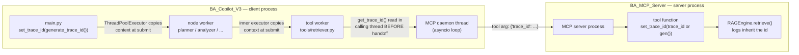

# Challenge 4: Trace ID Across Threads and Process Boundaries

## The Problem

A single BA workflow run produces logs from many nodes (each possibly on a different thread) **and** from a separate MCP server process. We needed one trace id to tag all of them so a single run could be reconstructed from the logs.

A plain module-level global fails twice:

- **Across threads** — a shared global is like one office whiteboard; two workers overwrite each other's value mid-flight.
- **Across processes** — V3 and the MCP server have completely separate memory; a global in one doesn't exist in the other.

## Why Each Mechanism Was Needed

| Boundary | Mechanism | Job |
|---|---|---|
| Within one process, across threads | `contextvars.ContextVar` | Transport the id to any thread doing this run's work |
| Between two processes | explicit `trace_id` tool argument | Carry the id over the JSON-RPC tool call |
| Inside the server, per request | `set_trace_id(trace_id or generate_trace_id())` | Re-establish the id at the top of each tool call |

## The Full Chain

### Two subtle points that made this work

1. **`ThreadPoolExecutor` copies the context at submit time**, not at thread start. Setting the id in `main.py` *before* `graph.stream()` is what lets node workers see it. Threads that already existed (like the MCP daemon thread) never inherit it.
2. **The daemon loop can't read your contextvar.** So `client_wrapper._call_tool_sync` captures `get_trace_id()` in the *calling* thread and passes it as a plain value into the coroutine.

## The Three Rules

1. **Generate once per run** — in `main.py`.
2. **Carry per request** — inject `trace_id` into the tool arguments.
3. **Set per call** — `set_trace_id(...)` at the top of every server tool.

## Why "set at server.py level" is wrong

The MCP server is a **long-lived process** handling many requests — from different runs, sometimes concurrently. A trace id set once at server startup would be one value for the whole server lifetime, and a single process-wide contextvar would be overwritten across simultaneous requests. The id is a property of **one run**, so it must be set **per tool call**.

## Key Takeaway

> State stores the id, ContextVar carries it within a process, and an explicit argument carries it across the process boundary. Generate once per run, carry per request, set per call.
