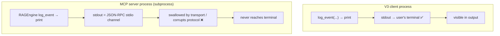

# Challenge 5: print() Logging Breaks Inside the MCP Server

## The Problem

After instrumenting RAG with a `print`-based `log_event`, the V3 terminal showed every node log and every `mcp` tool-call log — but **none** of the `rag` stage logs. They silently vanished.

```text
20:07:10 | ...967 | mcp | calling tool 'retrieve_similar_brd'
20:07:10 | ...967 | mcp | tool 'retrieve_similar_brd' completed
                                   ↑ no "rag | retrieve() query=..." lines anywhere
```

## Root Cause

The MCP server runs as a **separate subprocess**. Its `stdout` is not the user's terminal — it is the **JSON-RPC stdio transport channel** back to the client. `print()` writes to stdout, so server-side logs either get swallowed or risk corrupting the protocol stream.



This is the process boundary one level deeper than the trace id: the trace id correctly flows to the server, but the server's **output channel** is owned by the transport, not by you.

## The Fix

Stop using `print`. Use Python's `logging` module with a **file handler** (and/or stderr, which FastMCP leaves alone):

```text
log_event(...) → logging.getLogger("ba.observability")
                 ├── StreamHandler(stderr)      # safe in server, visible when run standalone
                 └── FileHandler("logs/ba_v3.log")  # survives the stdio boundary
```

Then inspect `logs/ba_v3.log` after a run — the `rag` stage logs finally appear next to the client logs, all sharing the trace id.

## Key Takeaway

> Never `print()` to stdout inside a stdio MCP server — stdout belongs to the JSON-RPC transport. Server-side logs must go to **stderr or a file**. Client-side logs can use stdout freely; the distinction is *which process* emits the log.
