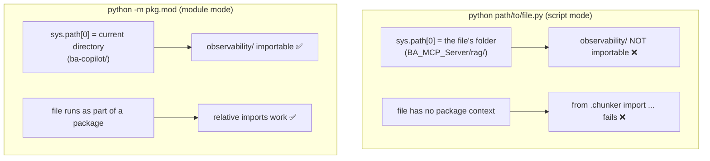

# Challenge 6: Script vs Module Execution — sys.path and Relative Imports

## The Problem

The same file behaved differently depending on how it was launched:

```text
python BA_MCP_Server/rag/rag_retriever_test.py
# → ModuleNotFoundError: No module named 'observability'
# → (then) ImportError: attempted relative import with no known parent package

python -m BA_MCP_Server.rag.rag_retriever_test
# → works
```

The `observability/` package lives at the **project root** (`ba-copilot/`), but a script run by path can't see it.

## Root Cause

Python resolves imports against `sys.path`, and that list is built differently in the two modes:



- **Script mode** puts only the script's own folder on the path, and gives the file no parent package — so both absolute imports of root packages *and* relative imports break.
- **Module mode** (`-m`) puts the current directory on the path and runs the file with proper package context.

## The Fix

Two valid approaches:

1. **For files inside packages** (like the RAG test): run them with `python -m pkg.mod` instead of `python pkg/mod.py`.
2. **For entry-point scripts** that must be run directly (`main.py`, `server.py`): bootstrap the project root onto `sys.path` at the very top, **before** any imports that need it:

```python
import sys
from pathlib import Path

sys.path.insert(0, str(Path(__file__).resolve().parent.parent))  # adds ba-copilot/
```

This is why both `BA_Copilot_V3/main.py` and `BA_MCP_Server/server.py` carry that line now.

## Key Takeaway

> Script mode = script's folder on the path, no package context. Module mode = cwd on the path + package context. Any entry-point script that imports a shared package (like `observability` at the project root) must bootstrap `sys.path` before those imports.
