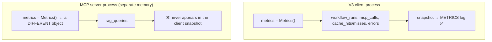

# Challenge 7: Cross-Process Metrics — Counters That Vanish

## The Problem

`rag_queries` was incremented inside the RAG engine, which runs in the **MCP server process**. But the final `METRICS` snapshot written by the V3 client never showed it:

```json
{"workflow_runs": 1, "llm_calls": 8, "tool_calls": 17, "mcp_calls": 17, "cache_misses": 2, "errors": 1}
```

No `rag_queries`. The counter was being incremented — into a Python object in a *different* process, where nobody could read it.

## Root Cause: objects don't cross process boundaries



Two processes = two separate `Metrics` instances, each living in its own memory space. Incrementing one has no effect on the other. This is the same boundary that swallowed the RAG logs (Challenge 5) — just one level deeper: the trace id and log lines crossed it, but a plain Python object cannot.

## The Fix: per-process metric files + a dashboard

Each process persists its own snapshot to its own file, and a dashboard merges them at read time.

```mermaid
flowchart LR
    subgraph Client["V3 client process"]
        A["metrics"] -->|save_metrics('v3_metrics.json')| V["observability/metrics/v3_metrics.json"]
    end

    subgraph Server["MCP server process"]
        B["metrics"] -->|save_metrics('mcp_metrics.json')| M["observability/metrics/mcp_metrics.json"]
    end

    V --> DASH["dashboard.py loads both files"]
    M --> DASH
    DASH --> OUT["V3 Metrics + MCP Metrics in one view"]
```

### Key implementation detail

Both processes write through one helper that anchors the path to `__file__`, so CWD doesn't matter (the same lesson as Challenge 1):

```python
METRICS_DIR = Path(__file__).resolve().parent / "metrics"

def save_metrics(file_name: str) -> None:
    metrics.save_snapshot(str(METRICS_DIR / file_name))
```

The dashboard also loads defensively — an empty, missing, or corrupt file returns `{}` — because on a fresh run a metric file may not exist yet, and `json.load` on a 0-byte file crashes with `JSONDecodeError`.

## Key Takeaway

> Metrics — like logs — live inside a process. To aggregate across a process boundary, persist each process's snapshot to its own file (or export it over the wire), then merge at read time. Never expect a Python object to be shared across processes.
