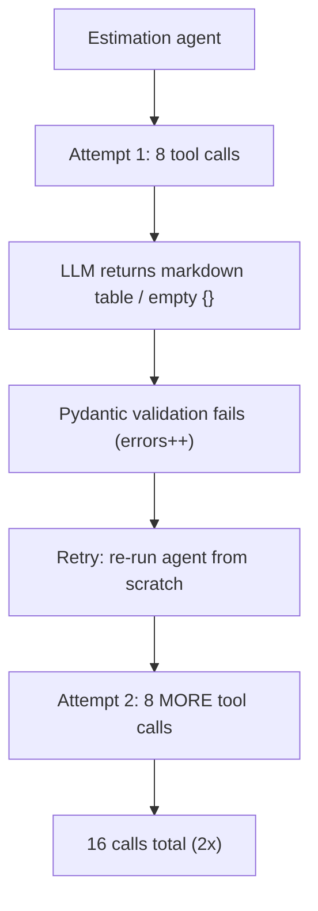
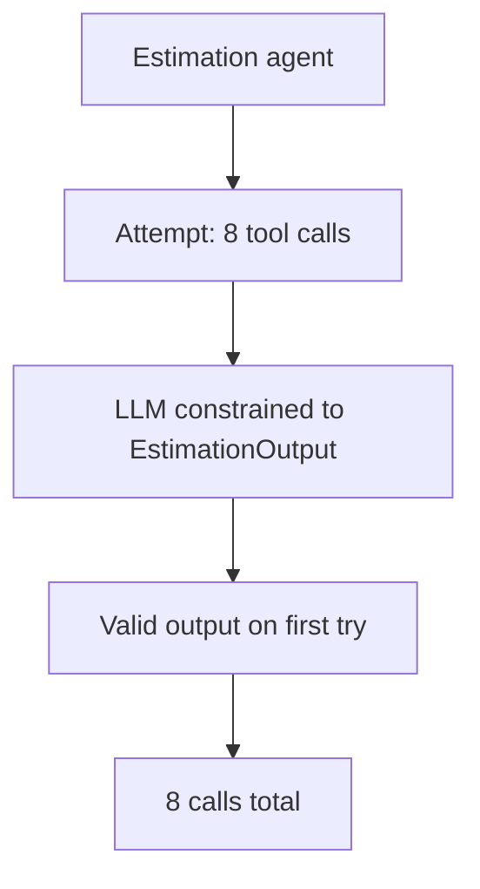

# Challenge 8: Retry Amplification — One Bad Output Doubles Tool Calls

## The Problem

Metrics showed `mcp_calls: 17` per run, but the workflow only needs ~9: one RAG query
(`retrieve_similar_brd`) plus one `calculate_story_points` call per user story (8 stories).

```json
{"workflow_runs": 1, "llm_calls": 8, "tool_calls": 17, "mcp_calls": 17, "cache_misses": 2, "errors": 1}
```

## Root Cause: a validation retry re-runs the whole agent loop

The estimation LLM was asked for JSON but returned a markdown table / empty object.
`invoke_with_validation` parsed it, failed Pydantic validation, and retried — but the retry
restarted the **entire ReAct agent**, so all 8 `calculate_story_points` calls were made
again.



The smoking gun was one error log line sitting between the two tool-call bursts:

```json
{"level": "error", "component": "invoke_with_validation", "message": "Validation Error in EstimationOutput (attempt 1): ... estimates Field required [input_value={}]"}
```

## The Fix: structured output

Constrain the agent's final answer with `response_format`, so the LLM cannot emit a
markdown table or a missing field:

```python
agent = create_agent(
    model=llm,
    tools=[calculate_story_points],   # intermediate ReAct tool calls
    response_format=EstimationOutput, # final answer must match this model
)
```

With the output guaranteed valid, the frequent JSON-shape failure disappears. A lean
`invoke_structured` helper still retries on rare exceptions (network/parser/tool), but
there is no validation feedback loop left to re-run the tools.



## Result

| Metric | Before | After |
|---|---|---|
| `mcp_calls` | 17 | 9 |
| `tool_calls` | 17 | 9 |
| `calculate_story_points` calls | 16 | 8 |
| `errors` | 1 | 0 |

## Key Takeaway

> A validation retry that restarts a tool-calling agent multiplies every tool call it made. Prefer constraining the output schema (`response_format` / `with_structured_output`) over retrying after-the-fact — fixing the shape at the source removes the retry entirely.
