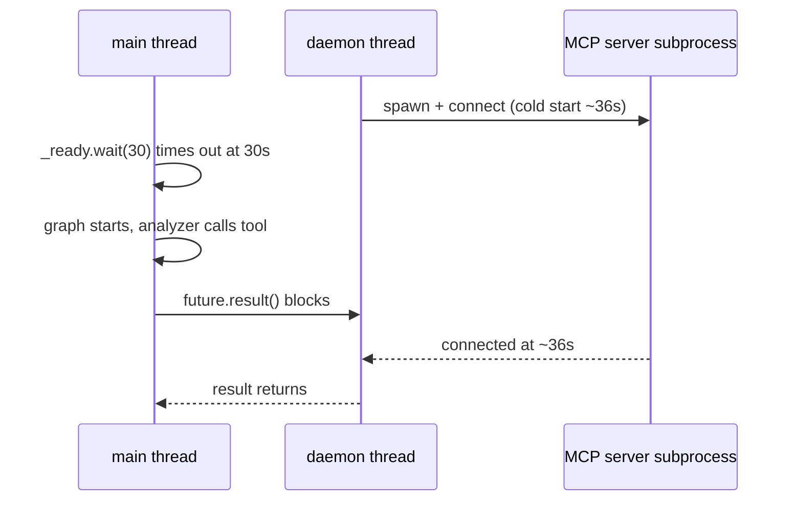

# Challenge 9: MCP Server Cold Start vs. the Readiness Timeout

## The Problem

The dashboard reported `ANALYZER` at 33 s and one `mcp` tool call at 27.7 s — far above
the usual ~1.4 s RAG retrieval. The workflow wasn't slow; it was **waiting**.

## Root Cause: the readiness wait timed out before the server was ready

`client_wrapper.py` blocks the main thread with `_ready.wait(timeout=30)` until the MCP
server connects. On a cold start, spawning `server.py` (which imports `fastmcp` + `torch`
+ `sentence-transformers` and builds the RAG engine) took ~36 s — longer than the 30 s
timeout. So the graph started before the server was ready, and the first tool call
blocked until it connected.



The smoking gun in the log: `calling tool 'retrieve_similar_brd'` at `17:24:00`, then
`Persistent server connected` at `17:24:26` — 26 seconds later.

## Diagnosis: it is NOT a download or a chunk rebuild

- The `all-MiniLM-L6-v2` model is cached locally (verified in the HF hub).
- `cached_chunks.json` is fresh (newer than the source `.txt` files).

So the 36 s is the **server subprocess startup** — heavy ML imports plus antivirus
scanning of a freshly spawned Python process on Windows.

## The Fix

Raise the readiness timeout so the cold start is absorbed *before* the graph runs:

```python
_ready.wait(timeout=120)   # was 30
```

Now the startup pause happens up front, and the first tool call is fast.

## Key Takeaway

> A readiness timeout shorter than the actual startup time silently shifts the cost into
> the first request. Match your wait time to the real cold-start duration — and let
> observability confirm the split between "startup" and "work" (the log showed RAG itself
> took 1.4 s of a 27.7 s call).
