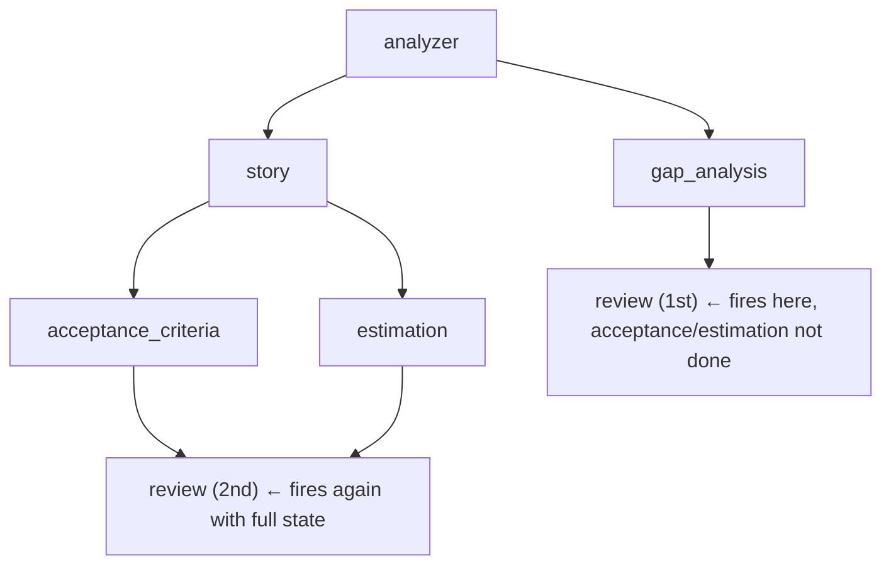

# Challenge 10: Workflow Duplication — The Review Node Runs Twice

## The Problem

The dashboard reported `REVIEW: count=2` every run, and the log showed `REVIEW Started`
and `REVIEW Completed` twice. The first review was a throwaway: it ran with
`acceptance_criteria` and `estimation` missing, produced a "N/A" review, then ran again
with full state.

```json
{"time": "21:22:30", "component": "REVIEW", "message": "Started"}
{"time": "21:22:35", "component": "REVIEW", "message": "Completed", "duration_ms": 5754.3}
{"time": "21:22:39", "component": "REVIEW", "message": "Started"}
{"time": "21:22:45", "component": "REVIEW", "message": "Completed", "duration_ms": 5837.86}
```

The smoking gun was the token count of the two review LLM calls in the same run:
`prompt=712` for the first, `prompt=1992` for the second. The first prompt was much
smaller because its inputs were the string `"N/A"`, not real artifacts.

## Why it happens: a fan-in node fires on the *first* dependency, not all three

`review` has three incoming edges:

```python
builder.add_edge('acceptance_criteria', 'review')
builder.add_edge('estimation', 'review')
builder.add_edge('gap_analysis', 'review')
```

It should wait for all three. But in the log, `REVIEW Started` fires the moment
`gap_analysis` completes — while `acceptance_criteria` and `estimation` are still
running:



The `review_node` silently papered over the missing inputs with a fallback, so the bug
produced *garbage output* instead of an error:

```python
acceptance_criteria=_safe_json(state.get("acceptance_criteria")),   # "N/A" if missing
estimation=_safe_json(state.get("estimation")),                     # "N/A" if missing
```

A node that substitutes `"N/A"` for absent state can never fail — and therefore never
reveals that it was scheduled too early.

## A masking bug hid it for a while

`gap_node.py` originally logged its component name as `"STORY"` (copy-paste from
`story_node`):

```python
def gap_node(state):
    log_event("STORY", "Started")   # should be "GAP"
```

So the duplicate `STORY Started` looked like a LangGraph replay artifact, and gap
analysis was invisible in the dashboard. Fixing the label to `"GAP"` (and adding a
`Completed` + duration) revealed the real duplication.

## Failed fix: unique `thread_id`

First hypothesis: the hardcoded `thread_id="portal_project_v3"` made every run resume
the previous run's SQLite checkpoint, whose stale `acceptance_criteria`/`estimation`
keys could satisfy the fan-in early.

```python
# main.py — was
config = {"configurable": {"thread_id": "portal_project_v3"}}
# now
config = {"configurable": {"thread_id": trace_id}}   # unique per run
```

This is correct practice and fixed cross-run state bleed, but `REVIEW: count=2`
persisted — so the duplicate execution is a **within-run scheduling issue**, not
checkpoint contamination.

## Status: still open

- **Fixed:** `gap_node` label + timing; unique `thread_id` per run.
- **Not fixed:** `review` still runs twice. The fan-in barrier is not being honored the
  way the three-edge diamond suggests it should be, and the `"N/A"` fallbacks hide it.
- **Cost:** ~1,166 wasted tokens/run (the first review) ≈ 8% of a run's tokens, plus a
  useless review artifact.

Next step to investigate: whether LangGraph schedules `review` in the same super-step as
`acceptance_criteria`/`estimation` (because `gap_analysis` completed a step earlier), or
whether the `"N/A"` fallback should be replaced with an explicit wait/assert.

## Key Takeaway

> A fan-in node that substitutes `"N/A"` for missing inputs silently hides scheduling
> bugs — it can never crash, so it can never tell you it ran too early. Log `Started` at
> node entry to catch duplicates, and make partial state fail loudly (or wait) instead of
> substituting a placeholder.
